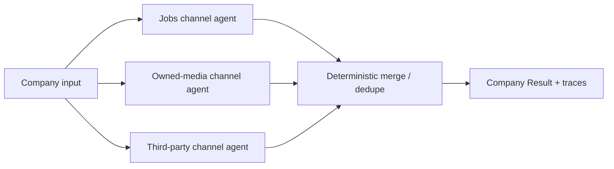
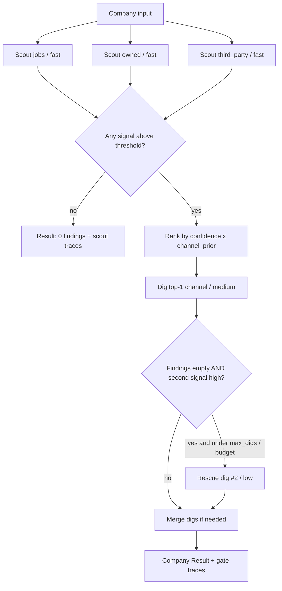
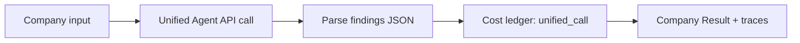

# Eval Harness Plan: Perplexity Agent API Playground

> Durable planning doc for Stage 2 architecture experiments. **Plan only. No implementation yet.**

---

## STATUS

| Field | State |
|---|---|
| **Current state** | Stage 1 frozen. March Stage 2 production run complete (~9.4k P4/P5 companies, ~2,062 findings). **Phase 1 structural scaffolding is in progress on branch `v2-scaffolding`:** top-level packages `parallel_channel_search/`, `signal_gated_search/`, `unified_adaptive_search/`, `evals/`, plus thin `contracts/` for shared Finding + cost ledger types. `python -m evals` exposes `run-evals`, `cost-preview`, `open-dashboard`. PCS/SGS are stub runners (ledger-shaped, no paid API). UAS extracts Stage 2 prompt/schema/request-kwargs patterns with dry-run default. March outputs under `outputs/stage2/` remain readable. `src/stage_2/` kept as compatibility shim + production batch path. **Not done yet (Phase 2+):** frozen Anchor Panel v1, paid panel runs, tabbed dashboards, Stage 3 judge. **Pricing research (Jul 2026):** see §0 below; today's `medium` = Luna (`openai/gpt-5.6-luna`), March was `deep-research` + `openai/gpt-5.2` at ~$0.32/company. |
| **Decisions / pivots locked** | See Locked Decisions below. Architecture trio + standalone folders + de-`src/` migration + **CLI trio** (`run-evals`, `cost-preview`, `open-dashboard`) are locked. **PCS:** 3 channels (jobs / owned / third_party), equal-depth `low` for v1 evals (may raise later if professor expands budget). **SGS:** Ranked Top-1 Dig (+ optional rescue) accepted as locked draft (§3.2); knobs still tunable via evals. **UAS:** single Agent API call per company; "adaptive" = hyperparams / prompt / search config (not channel fan-out). Domain filters: deferred. **Component cost ledger** required on every architecture result (professor what-if tradeoffs). **Prompts ownership (Phase 1 choice):** lean shared `prompts/` + optional per-system override folders. UAS still reads `prompts/stage_2_perplexity_prompt.txt` by default. |
| **Next steps** | (1) Land Phase 1 PR (`v2-scaffolding` → main) after review. (2) Finalize DRAFT dashboard tabs + metric formulas (Cost tab must show stacked component costs + professor what-if rows). (3) Freeze Anchor Panel membership (n≈10). (4) Phase 2 MVP: one live architecture end-to-end + tabbed dashboard instance. (5) Cheap smoke: 3–5 companies on today's `medium` to re-anchor $/company under Luna before trusting widget medians. (6) Revisit domain-filter strategy after focused `web_search` / filter docs pass. |
| **Open questions** | See §13. Blocking ones: exact Anchor Panel IDs, FACT-lite judge design, greenlight criteria for the 7,186 re-run, k for reliability. Domain filters remain deferred (not blocking skeleton). SGS dig policy tweaks (always 2 digs vs 1+rescue, dig preset, rescue on/off) are **eval levers**, not open design questions. Prompts ownership lean default accepted for Phase 1 (shared + optional overrides). |

### Locked Decisions

- **Architecture trio (product/paper names + CLI keys):**
  1. **Parallel Channel Search** - CLI: `parallel-channel-search` (short: `pcs`)
  2. **Signal Gated Search** - CLI: `signal-gated-search` (short: `sgs`)
  3. **Unified Adaptive Search** - CLI: `unified-adaptive-search` (short: `uas`)
- **Eval CLI product trio (locked):**
  1. `python -m evals run-evals <architecture>` - one architecture, one Anchor Panel pass, one dashboard instance
  2. `python -m evals cost-preview <architecture>` - estimate spend before a paid run (manual gate; architecture-aware)
  3. `python -m evals open-dashboard` - open the **landing index** of prior eval instances (not the per-instance tabbed page)
- **Repo shape:** build all **3 systems as standalone top-level packages**. **`evals/` is also standalone** and can apply any of the 3 against the Anchor Panel. Do **not** bury architectures as plugins inside evals only.
- **De-`src/` migration:** move away from organizing the repo by `src/`. Prefer import-friendly **snake_case** package folders; keep **kebab-case** CLI architecture names.
- **Provider:** Perplexity Agent API only for Stage 2 evals (no OpenAI/Gemini deep-research switch).
- **Cost ceiling (production designs):** ~$0.40/company for designs that would eventually re-run the hard cohort.
- **North star metric:** total verifiable findings (not binary company hit rate alone).
- **Stage 3 citation judge:** later. First harness leaves hooks only (schema field / tab placeholder), no judge implementation.
- **v1 dataset name:** **Anchor / Reference Panel** (user sometimes says "golden set"; same object). No human labels in v1.
- **v1 panel:** n≈10 companies, stratified from March positives that already had findings.
- **Stratification axes:** priority (P4/P5) × channel (jobs / owned / third_party) × multi-finding / multi-channel cases.
- **Reference bundles:** March production findings stored as soft references (tools, URLs, channels, cost), not hard truth.
- **Eval budget:** ~$5 per eval experiment.
- **Eval goals:** (1) complexity vs status-quo medium preset, (2) interpretability of traces for hyperparameter tuning, (3) measure non-determinism (k>1) before trusting A/B lifts.
- **Positives-only panel cannot alone greenlight the 7,186 `has_presence_no_evidence` re-run.** Later add an HPE contrast set.
- **Product vision:** every `run-evals` instance produces a **visual tabbed dashboard**; `open-dashboard` lists those instances from a landing index.
- **PCS design status:** component design drafted in §3.1; **channel count + equal-depth preset locked** (3 × `low`). Domain filters deferred. No package code yet. Must emit per-channel component costs in the cost ledger.
- **SGS design status:** **accepted / locked draft** in §3.2: **Ranked Top-1 Dig (+ optional rescue)**. Not implemented. Still tunable via evals (professor dig-policy levers). Must emit scout/dig/rescue component costs + counterfactuals.
- **UAS design status:** component design drafted in §3.3 (single medium-depth call; adaptive = knobs, not fan-out). Closest to today's `production_agent_runner.py`. Default E1 control arm. Must emit `unified_call` in the cost ledger.
- **Component cost ledger (cross-cutting):** every architecture result includes a structured cost ledger (§3.4). Dashboard Cost tab visualizes stacked components + professor what-if rows. Totals alone are not enough for thesis defense.
- **Skills intent:** harness patterns should generalize to other agentic research systems (investment research, market intelligence). Domain metrics stay specific to GenAI adoption measurement.

### Still open (not locked)

- Exact Anchor Panel company IDs / stratification counts.
- E0 budget trim (k=2 vs smaller n vs one-time >$5 reliability budget).
- FACT-lite v1 gate details.
- Greenlight criteria for the 7,186 re-run.
- Dashboard medium (static HTML vs local server).
- Whether "candidate new" findings count toward north star in v1.
- Prompts ownership: one shared `prompts/` tree vs per-system prompt folders (lean shared with optional per-system overrides; finalize in structural phase).
- How aggressively to keep `src/` as a thin compatibility shim during migration vs hard cutover.
- YAML vs JSON for eval configs.
- **Domain filters (PCS/SGS):** deferred. Plan note: mixture of hard `search_domain_filter` allowlists + prompt guidance, TBD after a focused API docs review later (not blocking skeleton; configs should leave filter lists optional/empty for v1).

---

## 0. Pricing & model notes (Jul 2026)

> Docs snapshot for professor cost talks. **Metered bill = tokens + tool invocations** from each response `usage` field. Pricing-widget preset medians are **illustrative only**, not billed values. Sources: [Presets](https://docs.perplexity.ai/docs/agent-api/presets), [Models](https://docs.perplexity.ai/docs/agent-api/models), [Pricing](https://docs.perplexity.ai/docs/getting-started/pricing), [Define the run](https://docs.perplexity.ai/docs/agent-api/building-agents/define-the-run), [Async deep research cookbook](https://docs.perplexity.ai/docs/cookbook/articles/async-deep-research/README), [Changelog](https://docs.perplexity.ai/docs/resources/changelog). Local March evidence: `outputs/stage2/production_results.csv` / `.jsonl`, `src/stage_2/production_agent_runner.py` (`DEFAULT_PRESET = "deep-research"`, `DEFAULT_MAX_STEPS = 10`).

### Preset rename + current `medium`

| Legacy name | Current preset | Current underlying model (docs) | Role |
|---|---|---|---|
| `fast-search` | **`fast`** | `openai/gpt-5.4-mini` | Single-fact / quick lookup; `max_steps=1`; `web_search` only |
| `pro-search` | **`low`** | `openai/gpt-5.6-luna` | Light multi-step; `max_steps=5`; `reasoning.effort=minimal`; `web_search` + `fetch_url` |
| **`deep-research`** | **`medium`** | **`openai/gpt-5.6-luna`** | Multi-hop research (cookbook: "formerly deep-research"); `max_steps=15`; `reasoning.effort=medium`; `web_search` + `fetch_url` |
| `advanced-deep-research` | **`high`** | `openai/gpt-5.6-sol` | Deeper / heavier |
| `ultra` | **`xhigh`** | `openai/gpt-5.6-sol` | Heaviest (+ sandbox tools in widget defaults) |

**Answer to "is medium Luna?":** yes. Current preset values pin **`medium` → `openai/gpt-5.6-luna`**. Dynamic presets can change later; freeze by copying current values and omitting `preset` ([Presets](https://docs.perplexity.ai/docs/agent-api/presets)).

### Official Agent tool fees (quoted)

From the pricing calculator source of truth on [Pricing](https://docs.perplexity.ai/docs/getting-started/pricing):

| Tool | Price |
|---|---|
| `web_search` | **$0.0025** per invocation |
| `fetch_url` | **$0.00025** per invocation |
| `people_search` / `finance_search` | $0.005 per invocation (not needed for Stage 2 default) |

Search API (separate product): **$5 / 1,000 requests** (~$0.005/query). Locked provider rule stays Agent API only unless we reopen that decision.

### Official token rates (selected, $/1M tokens)

From [Models](https://docs.perplexity.ai/docs/agent-api/models) / pricing widget `PRICING.agent.models` (Jul 2026 docs):

| Model | Input | Output | Notes |
|---|---|---|---|
| `openai/gpt-5.6-luna` | **$0.20** (low) / $0.40 (high) | **$1.20** (low) / $1.80 (high) | Changelog: Luna cut to $0.20 / $1.20; tier switch at **272k** input tokens |
| `openai/gpt-5.2` (March production) | $1.75 | $14.00 | Still listed; not what `medium` uses today |
| `openai/gpt-5.4-mini` (`fast` default) | $0.75 | $4.50 | Scout preset default |
| `openai/gpt-5.4-nano` | $0.20 | $1.25 | Cheap override candidate |
| `openai/gpt-5-mini` | $0.25 | $2.00 | Cheap override candidate |
| `google/gemini-3.1-flash-lite` | $0.25 | $1.50 | Cheap override candidate |
| `google/gemini-3.5-flash-lite` | $0.30 | $2.50 | Cheap override candidate |
| `openai/gpt-5.6-sol` (`high`/`xhigh`) | $5 / $10 tiered | $30 / $45 tiered | Do not use for scouts |

### Widget illustrative medians (NOT billed)

Pricing meta text: preset `input`/`output` tokens and per-run tool counts are **median values from representative runs (editable in the widget), NOT billed values**. Actual cost is metered from each response's `usage` field.

| Preset | Widget model | Illust. in / out tokens | Illust. tools / run |
|---|---|---|---|
| `fast` | gpt-5.4-mini | 1,000 / 500 | 1× `web_search`, 0× `fetch_url` |
| `low` | gpt-5.6-luna | 2,000 / 1,000 | 1× `web_search`, 1× `fetch_url` |
| `medium` | gpt-5.6-luna | 4,000 / 1,000 | 2× `web_search`, 2× `fetch_url` |

Those medians **massively understate** March production depth (below). Use them only as a lower-bound toy estimate, never as the cost prior for the 7,186.

### March local evidence (load-bearing prior)

Company-level rows from `production_results.jsonl` with `preset=deep-research` (n≈9,429 billed rows; model logged on every row):

| Metric | Value |
|---|---|
| Preset | `deep-research` (`DEFAULT_PRESET` in `production_agent_runner.py`) |
| Model used | **`openai/gpt-5.2`** (100% of deep-research rows) |
| Max steps | default **10** in runner (`DEFAULT_MAX_STEPS`) |
| Mean / median / p90 / p95 `$/company` | **$0.321 / $0.319 / $0.373 / $0.396** |
| Mean / median input tokens | ~188.4k / ~188.9k |
| Mean / median output tokens | ~1.67k / ~1.52k |
| Mean / median `search_results_count` | ~83 / ~79 (result rows returned, **not** the same as tool-invocation count) |

### March vs today's `medium`: more / less / unclear?

| Item | March (approx) | Now (docs) | Implication |
|---|---|---|---|
| Preset name | `deep-research` | `medium` | Same research tier; rename only |
| Underlying model | `openai/gpt-5.2` | `openai/gpt-5.6-luna` | **Large token-rate drop** if depth stays similar |
| Token rates (input/output $/1M) | Billed under then-current 5.2 rates (empirical ~$0.32 all-in) | Luna **$0.20 / $1.20** (low tier); 5.2 still **$1.75 / $14** if you pin it | At March mean volumes, **token-only** ≈ **$0.040** on Luna vs ≈ **$0.353** on current 5.2 rates |
| Tool fees | Included in `usage.cost.total_cost` | `web_search` **$0.0025**, `fetch_url` **$0.00025** | Tools stay; with heavy search loops tools can dominate once tokens get cheap |
| Widget medium estimate | n/a | ~$0.0075/call at illust. 4k/1k + 2/2 tools (Luna) | **Not comparable** to March; our jobs were ~50× more input tokens |
| Empirical $/company | **~$0.32 mean** | **Unclear until smoke-tested** | Directionally **likely less** than $0.32 if Luna keeps similar step/search depth; **not** "widget ~1¢". Worst case: more tool calls / longer context erase some of the token savings |

**Honest verdict:** today's default `medium` should be **cheaper than March** on pure model rates (Luna is far below GPT-5.2), but **final $/company is unclear** without a small paid smoke because (1) bill = tokens + tools, (2) widget medians are not our workload, (3) Luna may change tool/step behavior vs March 5.2. Re-measure on 3–5 companies before revising the $0.32 prior used in `cost-preview`.

### Overrides: keep `web_search`, change model

Docs ([Define the run](https://docs.perplexity.ai/docs/agent-api/building-agents/define-the-run), [Presets customizing](https://docs.perplexity.ai/docs/agent-api/presets#customizing-presets)):

- Pass `model` (or `models` fallback chain, up to 5) **alongside** a `preset` to override only the engine; other preset defaults remain.
- `tools` **merge per tool** (listing `web_search` options does not drop `fetch_url` from the preset).
- You can also omit `preset` and set `model` + `tools` + `instructions` explicitly (frozen config).

**Cheap scout / PCS override candidates** (all Agent API; can keep `web_search`):

| Candidate | $/1M in→out | Best use | Tradeoff |
|---|---|---|---|
| Keep **`preset=fast`** (`gpt-5.4-mini`) | $0.75 → $4.50 | **Default SGS scout** | Docs-aligned quick lookup; slightly pricier tokens than Luna/nano |
| `preset=fast` + `model=openai/gpt-5.6-luna` | $0.20 → $1.20 | **Best cheap A/B** for scouts | Same family as `low`/`medium`; may change scout quality vs mini |
| `preset=fast` + `model=openai/gpt-5.4-nano` | $0.20 → $1.25 | Ultra-cheap scout A/B | Risk: weaker signal calibration / more FN |
| `preset=fast` + `model=google/gemini-3.1-flash-lite` | $0.25 → $1.50 | Cross-provider cheap A/B | Quality/tool-calling variance vs OpenAI defaults |
| Keep **`preset=low`** (already Luna) | $0.20 → $1.20 | PCS channels; SGS rescue dig | Already cheap on tokens; cost driven by steps/tools |
| Pin `openai/gpt-5.2` | $1.75 → $14 | March replay only | Expensive; only for apples-to-apples historical compare |

### Practical inference-cost squeeze (stay on Agent API)

1. **`max_steps`** (scouts 1–2; digs capped; March used 10 vs medium default 15).
2. **`reasoning.effort`** (`minimal`/`low` on scouts; avoid `high`+ on digs unless ablation).
3. **`web_search` budgets:** lower `max_tokens`, `max_tokens_per_page`, optionally `max_results` / filters (filters still deferred).
4. **Drop `fetch_url` on scouts** (fast default already has 0 fetch); digs keep fetch.
5. **`max_output_tokens`** for short signal JSON / channel extracts.
6. **Lean `instructions`** (re-processed every step of the loop).
7. **Model override** on scout/PCS calls (table above) without leaving Agent API.
8. **Freeze configs** for reproducibility when dynamic `medium`/`low` drift would invalidate cost priors.

### Recommendations for evals

| Stage | Default | A/B in evals |
|---|---|---|
| **SGS scouts** | `preset=fast` (stock mini + `web_search`) | (A) `fast` + `model=openai/gpt-5.6-luna`; (B) `fast` + `openai/gpt-5.4-nano`; (C) `scout_preset=low` if FN hurts |
| **SGS dig #1** | `preset=medium` (Luna) | Dig=`low` if panel/`cost-preview` blows ~$5; optional freeze of medium values |
| **PCS channels** | `preset=low` (already Luna) | Model override only if channel quality fails; equal-depth still locked |
| **UAS control** | `preset=medium` | Optional arm: freeze + pin `openai/gpt-5.2` only if professor needs March replay dollars |

---

## 1. Goals & Non-Goals

### Why this exists

The March single-agent Stage 2 run left a large hard set (~7,186 companies with online presence but no evidence) and a hypothesis that **channel-targeted / multi-agent architectures** raise total verifiable findings under a ~$0.40/company ceiling. There are too many Perplexity Agent API knobs (preset, steps, search tool calls, prompts, parallel strategies) to choose by intuition. The harness turns architecture choice into a **cheap, repeatable, visual experiment** before committing grant budget to the hard cohort.

### Goals

1. **Architecture playground:** run any of the three named agentic systems against the same Anchor Panel and get comparable outputs.
2. **Dashboard-first evaluation:** every paid instance ends in a tabbed HTML dashboard a professor can open without reading JSONL.
3. **Trace interpretability:** enough process signal to tune hyperparameters (where the agent searched, what it cited, how many steps/tools, why it stopped).
4. **Reliability before A/B trust:** quantify non-determinism with k>1 before claiming architecture lifts.
5. **Budget discipline:** ~$5 per experiment; cost visible before and after each run.
6. **Standalone systems + harness:** three production-shaped packages you can run outside evals, plus a harness that orchestrates them for comparison.
7. **Reusable skills:** package layout and CLI habits that transfer to other agentic research evals, even when metrics differ.

### Non-goals (v1)

- Human gold labeling or professor review UI.
- Stage 3 citation-judge implementation (hooks only).
- Greenlighting the 7,186 re-run from the positives-only panel alone.
- Multi-provider deep-research backends.
- Perfect metric science on n≈10 (directional + interpretability first; statistical claims later with larger sets).
- Implementing architectures before the structural migration plan is agreed (this doc first).

---

## 2. Inspiration Notes (Principles Only)

**Source (read-only):** `/Users/k/Desktop/ai-native-startup-classification/evals`  
(also mirrored under `data visualization/01_Presentation_Materials/eval_instances/`)

Do **not** copy that project's classification metrics, golden-set labeling workflow, Pass A/B banks, or dashboard axis design. Borrow workflow habits only:

| Principle | What they do | What we take |
|---|---|---|
| **CLI as product** | `python -m evals <subcommand>` with `run-evals`, `cost-preview`, `open-dashboard` | Same locked trio: `run-evals` (one arch → one instance), `cost-preview` (manual estimate), `open-dashboard` (landing index). Durable entrypoint is top-level `evals`, not under `src` |
| **Run identity is the config** | Runs named like `YYYY-MM-DD_<model>_<effort>_rN` under `evals/runs/<run_id>/` | Name runs from architecture/config + date + repeat index |
| **Artifact bundle per run** | `config.json`, predictions, `raw/`, `scored.json`, `run.log` | Snapshot config + predictions + raw API payloads + scored summary + log |
| **Dashboard is the deliverable** | Build HTML; archive numbered instances + index so paid sweeps stay clickable | Every `run-evals` produces a per-instance tabbed dashboard; `open-dashboard` opens the landing index of those archives |
| **Cost gate before spend** | `cost-preview` + confirm before matrix | Manual `cost-preview` from panel size × architecture-aware expected calls/presets (no paid run required) |
| **Harness vs production ownership** | Eval package owns scoring/dashboard; production package owns the model contract | `evals` owns panel, scoring, dashboard; each of the 3 systems owns its Agent API call contracts |
| **Offline scoring when possible** | Score from saved predictions without re-paying | Metrics recompute from saved run artifacts |

**Deliberate differences for this repo**

- Call the set an **Anchor / Reference Panel**, not golden (no human labels yet). User may say "golden set" conversationally; plan and code should prefer **Anchor Panel**.
- Instance model is **one named architecture vs the panel** (plus optional baseline compare), not a 3×3 model×effort classification matrix.
- Dashboard tabs answer **research-agent dimensions** (findings yield, traces, citation support, cost/reliability), not classification accuracy/calibration.
- Architectures live as **standalone packages**, not only as eval strategy plugins.

---

## 3. Three Architectures (Locked Names)

Use full product/paper names as primary labels. CLI accepts kebab-case keys (and optional short aliases).

| Full name | CLI key | Short alias | Package folder | What it is | What it optimizes |
|---|---|---|---|---|---|
| **Parallel Channel Search** | `parallel-channel-search` | `pcs` | `parallel_channel_search/` | n channel-specialized agents of equal depth (jobs, owned, third_party, etc.), then merge | **Breadth:** raise yield by covering channels in parallel without one agent starving another |
| **Signal Gated Search** | `signal-gated-search` | `sgs` | `signal_gated_search/` | Cheap per-channel scouts first; escalate a **ranked** dig only where signal is strongest (not all positive channels) | **Depth/gating:** spend deep research dollars where cheap signals suggest evidence exists, while staying cheaper than PCS on average |
| **Unified Adaptive Search** | `unified-adaptive-search` | `uas` | `unified_adaptive_search/` | Single medium-depth, non-channel-specific agent (status-quo shape) with Perplexity hyperparameters tuned for findings/$ | **Efficiency baseline:** best single-agent findings per dollar; the status-quo comparator |

### Why these three (and not more)

They span the main design axes you care about: **breadth (parallel channels)** vs **gated depth (cheap then expensive)** vs **unified status quo (one adaptive agent)**. That is enough for E1 to answer "does architecture beat a tuned single agent under $0.40?" without exploding the experiment matrix.

### Mental models

- **Parallel Channel Search:** like sending three specialists into different rooms at once, then combining notes. Good when March traces show channel blindness (e.g. jobs never searched).
- **Signal Gated Search:** like three cheap flashlights (one per channel room), then one paid deep dive into the room that looks most promising. Most companies get scouts only; digs are ranked and capped. Good when you must stretch budget across the 7,186 without recreating PCS cost.
- **Unified Adaptive Search:** one generalist with better knobs (preset, steps, search caps, prompts). Good as the fair baseline: if specialists cannot beat a tuned generalist, complexity is not worth it.

### Eval CLI examples (locked product trio)

```bash
# Manual cost gate (run when you need an estimate; does not call paid APIs)
python -m evals cost-preview parallel-channel-search
python -m evals cost-preview parallel-channel-search --k 3

# One architecture × Anchor Panel → one eval dashboard instance
python -m evals run-evals parallel-channel-search
python -m evals run-evals signal-gated-search
python -m evals run-evals unified-adaptive-search
python -m evals run-evals pcs   # short alias OK if implemented

# Open the landing index of prior instances (navigate into one from there)
python -m evals open-dashboard
```

**Landing index vs per-instance dashboard (clarify):**

| Surface | What it is | How you get there |
|---|---|---|
| **Landing index** | List/archive page of prior eval run instances (run id, architecture, date, spend, link) | `python -m evals open-dashboard` |
| **Per-instance tabbed dashboard** | One run's Findings / Traces / FACT-lite / Cost tabs | Built by `run-evals`; opened by picking that instance from the index (optional later: `open-dashboard --run-id …`) |

### How `evals` depends on each system (thin adapter)

Harness does **not** own channel fan-out, gates, or Agent API prompt contracts. It owns panel load, orchestration, scoring, and dashboards.

```
evals.run_panel(architecture, panel, config)
  → import system by cli_key (e.g. parallel_channel_search)
  → for each company (× k): system.run(company, **knobs) → normalized Result
  → write run_dir (predictions, raw, traces, scored)
  → build per-instance dashboard.html (+ archive into landing index)
```

Public contract each system exposes (draft): `run(company) -> Result` with findings, cost/usage, **component cost ledger** (§3.4), per-subcall traces. Optional batch helper is fine; evals can also loop `run` itself.

Harness responsibility: load Anchor Panel, invoke the chosen system's public runner, write predictions/raw/traces, score, build tabbed dashboard for that instance, update landing index.

System responsibility: own prompts/hyperparameters/fan-out/merge logic and return a normalized result the harness can score.

---

## 3.1 Parallel Channel Search - component design (draft)

> **Status:** plan draft; **v1 knobs locked** (3 channels × equal `low`). Domain filters deferred. No `parallel_channel_search/` package code yet.

### Locked meaning of PCS

- **n channel-specialized agents of equal depth** (breadth strategy, not gated depth).
- **Channels (locked):** **jobs** / **owned media** / **third-party** (n=3).
- **Equal-depth preset (locked for v1 evals):** all three channels at **`low`**. May raise later (e.g. to `medium`) if the professor expands budget; treat that as an ablation, not the default.
- Each channel agent **extracts findings** (not mere scouts that only return URLs).
- **Deterministic merge/dedupe** after parallel agents finish.
- **Perplexity Agent API only.**
- Production cost ceiling later ~**$0.40/company**; evals use Anchor Panel (~10).
- **Domain filters (deferred):** do not lock hard allowlists vs prompt-only guidance yet. Note for later: mixture of hard `search_domain_filter` + prompt guidance TBD after a focused API docs review. v1 configs leave filters optional/empty.

### Why this shape

One medium generalist often under-searches a channel (March traces showed channel blindness). PCS forces dedicated budget into each channel room, then merges notes so jobs evidence is not crowded out by news browsing. Equal depth means we do not silently starve a channel with a cheaper scout preset while another gets medium.

### End-to-end flow



Plain sequence:

1. Harness (or CLI) passes one company record into `parallel_channel_search.run(company)`.
2. PCS fans out **n** equal-depth Agent API calls in parallel (one per enabled channel).
3. Each call returns structured **findings[]** for that channel (plus raw response for traces).
4. Merge layer unions findings, dedupes by stable keys (tool + URL + channel heuristics), tags provenance (`channel`, `agent_id`).
5. Return normalized `Result` (findings, **component cost ledger** with one row per channel agent, merged `total_usd`, trace bundle).
6. `evals` scores the panel and builds **one** dashboard instance for that PCS config.

### Package components (rough modules)

Proposed under `parallel_channel_search/` (names indicative, not frozen):

| Module | Role |
|---|---|
| `channels.py` / `channel_configs/` | Per-channel domain filters, instruction templates, default presets, enabled flag |
| `agent_call.py` | Thin Perplexity Agent API wrapper: build request, call, parse JSON findings, attach usage/cost |
| `channel_runner.py` | Run one channel for one company (`instructions` + `input` + tools + schema) |
| `merge.py` | Deterministic merge + dedupe across channel results |
| `runner.py` | Public entry: `run(company) -> Result` (what `evals` imports) |
| `__main__.py` | Optional: run one company / small batch outside evals |
| `types.py` | `Finding`, `ChannelResult`, `Result` shapes shared with harness normalization |

Prompts may live in package-local strings initially, or pull from `prompts/parallel_channel_search/` once ownership is finalized in Phase 1.

### Perplexity Agent API mapping (per channel call)

Each channel agent is **one** Agent API request. Mapping draft:

| API surface | PCS draft choice | Why |
|---|---|---|
| `preset` | **`low` for v1 evals (locked)** | Equal depth × 3 channels multiplies cost; `low` is the realistic envelope for ~$0.40/company and ~$5 panel experiments. **Tension:** PCS equalizes at `low`, which may be shallower than UAS `medium`. Raise to equal-`medium` only if professor expands budget / cost-preview allows. |
| `instructions` | Channel specialist system contract: what counts as evidence for this channel, output discipline, no cross-channel wandering | Stable policy; same structure across channels, different channel rules |
| `input` | Company identity + homepage + short description + channel-specific search hints | Per-company payload; keep instructions reusable |
| `tools` | `web_search` (with `search_domain_filter` where useful) + `fetch_url` | Jobs: job-board / careers domains; owned: company host + blog/docs paths; third-party: news/podcast/review domains or looser filter if filter is too brittle |
| `response_format` | JSON schema with `findings[]` (tool, evidence snippet, URL, channel tag, optional confidence) | Harness scores structured rows, not free prose |
| `max_steps` | Shared integer budget **per channel** (equal-depth policy) | Tunable hyperparameter; same value for every enabled channel in a run |
| Reasoning effort / related knobs | Same value per channel when exposed by API | Keep equality; sweep later in E2 |

**What to capture in traces (for eval interpretability):**

- Per channel: request snapshot (`preset`, `max_steps`, domain filter, prompt ids), response id/status, usage/cost, search URLs, citation URLs, steps used, caps hit, parsed findings, raw payload path.
- After merge: which findings survived, which were dropped as dupes, provenance map finding → channel.
- Panel-level: per-company channel coverage gaps vs March soft reference channels.

### Equal-depth policy

**"Equal" means:** every enabled channel agent in a run uses the **same preset**, the **same `max_steps` budget**, and the **same reasoning-effort / search-cap knobs** (when set). Channels differ only in instructions, domain filters, and company `input` hints, not in spend class.

Not equal-depth: scout-at-`low` then escalate one channel to `medium` (that is closer to Signal Gated Search).

### n channels (locked)

| Option | Stance | Why |
|---|---|---|
| **3 channels** (jobs + owned + third_party) | **Locked default** | Matches the PCS thesis (breadth across the three research channels). User confirmed. |
| **2 channels** | Ablation / emergency budget trim only | Config-driven `enabled_channels`; if 3×`low` blows the envelope, disable third_party first. Not the v1 default. |

### Hyperparameters the eval harness should sweep later

Expose in `evals/configs/parallel_channel_search.yaml` (names indicative):

- `preset` (`low` locked default; `medium` as later ablation if budget expands)
- `max_steps` (and any max search tool call caps)
- `enabled_channels` (subset of jobs / owned / third_party)
- Per-channel `search_domain_filter` lists (and on/off): **deferred**; leave empty until filter strategy is decided
- Prompt variant ids / instruction file paths
- Merge dedupe keys / similarity thresholds (keep deterministic; sweep only if needed)
- Timeouts / retry policy (affects cost and empty rates)
- `k` repeats (harness-level, not PCS-internal)

### PCS open items (non-blocking)

1. ~~Channel count~~ → **locked at 3**.
2. ~~Equal-depth preset~~ → **locked at `low`** (may raise later with budget).
3. **Domain filters:** deferred. Mixture of hard filters + prompt guidance TBD after API docs review later.

---

## 3.2 Signal Gated Search - component design (locked draft)

> **Status:** **accepted / locked draft.** Escalation policy: **Ranked Top-1 Dig (+ optional rescue)**. Knobs remain tunable via evals (professor dig-policy levers below). No `signal_gated_search/` package code yet. Name is **Signal Gated Search** (CLI: `signal-gated-search` / `sgs`). Do not call it "SGR".

### Research inputs (why this design)

**A. Perplexity Agent API (docs-backed)**

- Presets are tiered: `fast` (single-fact / quick lookup) → `low` (light multi-step) → `medium` (multi-hop deep research; formerly `deep-research`) → `high` / `xhigh`. ([Presets](https://docs.perplexity.ai/docs/agent-api/presets))
- Scouts match **`fast`**: one-shot signal check, not multi-hop extraction. Digs match **`medium`** (or `low` under tight eval budget): chaining evidence across sources.
- `instructions` **replaces** the preset system prompt (omit to keep preset defaults). Prefer lean instructions; put machine constraints in `response_format` / tool filters. ([Prompt the agent](https://docs.perplexity.ai/docs/agent-api/building-agents/prompt-the-agent), [Define the run](https://docs.perplexity.ai/docs/agent-api/building-agents/define-the-run))
- `max_steps` bounds the tool loop; at low values the model can still call a tool once but cannot deeply iterate. Good scout lever.
- `web_search` supports `search_domain_filter`, `search_context_size`, token budgets. Domain-filter strategy shared with PCS: **deferred**. ([Web search](https://docs.perplexity.ai/docs/agent-api/tools/web-search))
- Async / concurrent Agent calls are supported (cookbook batch pattern with a small semaphore). Scouts should fan out in parallel the same way.
- Pricing is metered from `usage` (tokens + tool invocations). Widget medians for `fast`/`low` are illustrative only; March empirical **`medium` ≈ $0.32/company** is the load-bearing cost prior. Search API is ~$5/1k requests (~$0.005/query) for raw ranked results. ([Pricing](https://docs.perplexity.ai/docs/getting-started/pricing), [Search quickstart](https://docs.perplexity.ai/docs/search/quickstart))

**Search API for scouts (optional future, not default):** raw Search would make scouts cheaper and more deterministic (keyword/URL hits without an LLM gate). That is attractive for FN/FP control. It **violates the locked "Perplexity Agent API only" provider rule** if used as a second product surface. **Default stays Agent `fast`.** Revisit Search-API scouts only if Anchor Panel shows scout FN/FP dominating yield; document as optional future ablation.

**B. Frontier patterns (brief)**

- **LLM cascades / model routing:** try cheap tier first; escalate only when a calibrated signal says the cheap answer is insufficient ([TMLS on routing & cascades](https://www.tmls.nyc/research/model-routing-cascades); [Agent Patterns: multi-model routing](https://www.agentpatternscatalog.org/patterns/multi-model-routing/)).
- **CascadeDebate (ACL 2026 industry):** escalation boundaries need deliberation/calibration; naive "unsure → always escalate" burns the savings ([CascadeDebate](https://aclanthology.org/2026.acl-industry.93.pdf)).
- Implication for SGS: the gate must be a **ranked budget policy**, not "any positive scout → full dig on that channel."

**C. March production signals** (`outputs/stage2/production_results.csv`, re-verified)

| Fact | Value | Design implication |
|---|---|---|
| HPE cohort | **7,186** `has_presence_no_evidence` | Gating's main ROI is skipping digs here |
| Positives | **1,247** companies with findings | Panel / recovery experiments live here |
| Single-channel positives | **~90.7%** (prior note ~89.6%; same story) | Escalating all signaled channels is usually redundant |
| Channel presence among positives | owned ≫ jobs > third_party (company-level) | Rank owned highest when ties/confidence are close |
| Median findings among positives | **1** | North star is often won by one good dig, not three |
| Cost | mean **~$0.32**/company; **flat vs finding count** | Depth preset, not finding cardinality, drives spend |
| Perfect-scout digs needed | ~**1.10** channels/positive | Even with perfect recall, mean digs ≪ 3 |

**When gating helps:** HPE-heavy production (most companies). Scouts that correctly return no signal turn a ~$0.32 medium call into scout-only spend.

**When gating hurts:** scout **false negatives** on a sole-channel positive (~50% of single-channel cases are owned-only, ~28% jobs-only, ~22% third-party-only). Miss that channel → company yield = 0. Scout **false positives** on HPE → wasted digs; if policy escalates all three positives, noisy scouts recreate PCS cost **plus** scout overhead.

### Chosen design (accepted / locked draft)

**Ranked Top-1 Dig (+ optional rescue):** refine the user's 3-scout hypothesis; do **not** escalate every positive channel. Locked as the SGS default shape; hyperparameters and dig policy remain **eval-tunable** (see professor levers + component cost accounting).

1. Run **3 parallel channel scouts** at Agent preset **`fast`** (jobs / owned / third_party).
2. Each scout returns structured **signal** (bool + confidence + urls/snippets), not full findings.
3. **Stop** if no channel clears the signal threshold (company result: empty findings, scout traces only).
4. Otherwise **rank** signaled channels by `confidence × channel_prior` (default prior: owned > jobs > third_party from March).
5. Run **at most one dig** at preset **`medium`** on the top channel (channel-specialist extract, PCS-like schema).
6. **Rescue (optional, default on):** if the first dig returns **zero** findings and a second channel has `confidence ≥ rescue_threshold`, run **one** more dig at **`low`**. Hard cap: **`max_digs_per_company = 2`**.
7. Merge dig outputs with PCS-like deterministic dedupe when ≥2 digs ran.
8. Enforce a **budget guard** (`max_usd_per_company`, default ~0.40).

**Why this beats the naive alternatives**

| Alternative | Verdict |
|---|---|
| **Pure PCS (3×`low`)** | Always pays three extractors. Correct breadth test, but wastes spend on ~91% single-channel positives and on HPE. SGS asks a different question: can gates buy depth where signal exists? |
| **Pure UAS (`medium`)** | Fair status-quo baseline (~$0.32 flat). No channel focus; March channel-blindness risk remains. SGS keeps channel partitioning in the scout layer. |
| **User exact: 3 scouts → dig every positive channel** | Right scout idea, wrong escalation. On positives with perfect scouts it is mostly fine (~1.1 digs). On HPE with noisy scouts (FP ~0.2–0.33/channel) expected digs approach 0.6–1.0 **per company**, and if digs are `medium` you approach or exceed PCS/`UAS` cost **plus** scout overhead. With median findings = 1, extra digs rarely buy yield. |
| **Ranked Top-1 Dig (+ rescue)** | Keeps the clever part (cheap parallel channel probes). Caps digs so average production cost stays **meaningfully below PCS** when most companies are HPE/no-signal. Under perfect ranking, top-1 channel retains ~**92%** of March positive finding rows; top-2 (rescue path) retains ~**99.9%**. |

**Analogy:** three cheap flashlights check three rooms; you pay for a thorough search of the **most promising** room, and only reopen a second room if the first was empty but another flashlight was bright.

### End-to-end flow



Plain sequence:

1. `signal_gated_search.run(company)` fans out 3 scout Agent calls in parallel.
2. Gate policy scores/ranks scout outputs; may stop with no digs.
3. Dig #1 (medium, top channel) extracts `findings[]`.
4. Optional rescue dig #2 (low) if empty + strong runner-up.
5. Merge/dedupe dig findings; attach scout+gate+dig traces.
6. `evals` scores the panel the same way as PCS/UAS.

### Scout stage

| Knob | Draft choice | Why |
|---|---|---|
| Preset | **`fast`** | Docs: single-fact / quick lookup. Scouts answer "is there GenAI-adoption smoke in this channel?" not full extraction. Prefer `fast` over `low` so scout overhead stays small vs digs. |
| `max_steps` | **1–2** (default 2) | Enough for one search (+ optional fetch); prevents scout from becoming a mini-researcher |
| Channel partitioning | Same three channels as PCS | Keeps architectures comparable; scout instructions are channel-specialist |
| Tools | `web_search` (filters deferred/optional); `fetch_url` optional/off for v1 scouts | Keep scouts cheap; digs can fetch |
| Output schema | Structured JSON, **not** full findings | See below |

**Scout `response_format` (draft schema):**

```json
{
  "channel": "jobs|owned|third_party",
  "signal": true,
  "confidence": 0.0,
  "urls": ["https://..."],
  "snippets": ["short evidence smoke..."],
  "rationale": "one sentence"
}
```

Rules for scouts (in `instructions`):

- `signal=true` only if a URL+snippet suggests **specific** GenAI tool adoption evidence in this channel (not generic "AI company" vibes).
- Prefer precision over recall **slightly**, but not so hard that sole-channel jobs/third_party get starved (monitor FN in evals).
- Do **not** emit full finding rows; that is the dig's job.
- Pass scout `urls`/`snippets` into the dig `input` as warm-start hints (dig may search beyond them).

### Escalation policy (the clever part)

| Rule | Draft default | Rationale |
|---|---|---|
| Which channels escalate? | **Only ranked top-1** among signaled channels | ~91% of positives are single-channel; mean channels/positive ≈ 1.10 |
| Max digs / company | **1**, plus optional rescue → **hard cap 2** | Prevents "3 positive scouts → 3 digs = PCS + overhead" |
| Dig #1 preset | **`medium`** | Matches March status-quo depth that actually produced findings; SGS spends that depth **once**, gated |
| Dig #2 (rescue) preset | **`low`** | Cheaper second look; only if dig #1 empty + strong second signal |
| Stop if no signal | **Yes** (no digs) | Primary HPE savings |
| Escalate all signaled channels? | **No** (default off) | Ablation flag `escalate_all_signaled=false`; keep for science, not production default |
| Channel prior | owned > jobs > third_party | March company-level presence ordering |
| Budget guard | `max_usd_per_company ≈ 0.40`; skip rescue if projected over | Production ceiling; evals also respect `max_usd_per_experiment` via harness |
| Eval budget (~$5 / n≈10) | Prefer dig `#1 = medium` if `cost-preview` ≤ ~$5; if not, ablation dig `#1 = low` | Do not silently change architecture meaning; preview first |

**Cost intuition (order-of-magnitude, not a promise):**

- Scout tax: 3×`fast` should be a small fraction of one `medium` (measure empirically; docs pricing widget understates real medium vs March ~$0.32).
- HPE with well-calibrated scouts: mostly scout-only → **large** savings vs UAS/PCS.
- HPE with noisy scouts (high FP): Top-1 policy still caps digs at ~1 medium when any scout fires, vs escalate-all which can approach multi-dig PCS spend.
- Target: average $/company on a mixed or HPE-heavy set **clearly below** PCS 3×`low`, while recovering yield on sparse-signal positives via a deeper single dig.

### Merge

Reuse PCS-shaped merge when ≥2 digs ran:

- Union `findings[]`
- Dedupe by stable keys (tool + URL + channel heuristics)
- Provenance: `channel`, `stage` (`dig` / `rescue_dig`), `scout_confidence`
- Always persist scout outputs in traces even when no dig ran

### Package modules (`signal_gated_search/`)

| Module | Role |
|---|---|
| `channels.py` | Channel ids, priors, instruction templates, enabled flags |
| `scout.py` | Build/run one scout call (`fast`, signal schema) |
| `gate.py` | Thresholding, ranking (`confidence × prior`), stop / top-1 / rescue decisions |
| `dig.py` | Channel dig runner (`medium`/`low`, findings schema; can share patterns with PCS channel runner) |
| `merge.py` | Deterministic merge/dedupe across digs (PCS-like) |
| `budget.py` | Running cost tally + guard (skip rescue / refuse dig if over ceiling) |
| `runner.py` | Public `run(company) -> Result` |
| `types.py` | `ScoutResult`, `GateDecision`, `Finding`, `Result` |
| `__main__.py` | Optional one-company / small-batch CLI outside evals |

Prompts: package-local or `prompts/signal_gated_search/` once ownership is finalized.

### Perplexity Agent API mapping

**Scout call**

| API surface | SGS draft |
|---|---|
| `preset` | `fast` |
| `instructions` | Channel scout contract: smoke-test only; precision-leaning signal rules; JSON discipline |
| `input` | Company identity + homepage + description + channel search hints |
| `tools` | `web_search` (domain filters deferred/optional) |
| `response_format` | Signal schema above |
| `max_steps` | 1–2 |
| Traces | preset, urls, snippets, signal, confidence, usage/cost, raw path |

**Dig call**

| API surface | SGS draft |
|---|---|
| `preset` | `medium` (dig #1); `low` (rescue) |
| `instructions` | Channel specialist extract (same spirit as PCS channel agent) |
| `input` | Company identity + **scout warm-start** urls/snippets + channel hints |
| `tools` | `web_search` + `fetch_url` |
| `response_format` | `findings[]` (tool, evidence, URL, channel, confidence) |
| `max_steps` | Higher than scout; shared dig default (tunable) |
| Traces | gate decision, channel chosen, rank score, caps, findings, usage/cost |

### Hyperparameters for later sweeps

Expose in `evals/configs/signal_gated_search.yaml`:

- `scout_preset` (`fast` default; `low` ablation)
- `scout_max_steps`
- `signal_threshold`, `rescue_threshold`
- `channel_prior` weights
- `dig_preset` / `rescue_dig_preset`
- `max_digs_per_company` (1 or 2)
- `escalate_all_signaled` (bool ablation; default false)
- `max_usd_per_company`
- `enabled_channels`
- Domain filters (deferred; optional lists)
- Prompt variant ids
- `k` (harness-level)

### Component cost accounting (required)

Totals alone (`$/company`) are **not enough** for professor meetings. SGS must emit a **component cost ledger** (schema in §3.4) so dig-policy tradeoffs are visible without re-running guesswork.

**Per-company component names (draft):**

| Component name | What it is | Typical preset |
|---|---|---|
| `scout_jobs` | Jobs-channel scout call | `fast` |
| `scout_owned` | Owned-media scout call | `fast` |
| `scout_third_party` | Third-party scout call | `fast` |
| `dig_1` | Ranked top-1 dig (first extract) | `medium` |
| `dig_rescue` | Optional second dig (only if policy fired) | `low` |

Each component row logs at least: `name`, `preset`, `cost_usd`, plus optional `channel`, `ran` (bool), `skipped_reason`. Company `total_usd` = sum of ran components. Panel aggregates must also report:

- % companies that **stopped at scouts** (no dig)
- % companies that ran **dig_1 only**
- % companies that **triggered rescue** (`dig_rescue` ran)
- Mean cost split: scout tax vs dig_1 vs dig_rescue
- **Counterfactuals (professor what-if rows):** e.g. "if we always ran dig_2 at `medium` instead of 1 dig + optional rescue: estimated +$X/company (and +$Y on panel)"; "if rescue off: estimated −$X, yield ΔZ"

**Dashboard home:** Cost & Reliability tab (§7 Tab 4). Stacked component costs + what-if rows live there (not buried only in Findings).

### Professor decision levers (SGS dig policy)

These are the levers the dashboard must make cheap to discuss. Defaults stay locked; evals measure the deltas.

| Lever | Default (locked draft) | Alternative to measure | Why a professor might flip it |
|---|---|---|---|
| Dig count policy | **1 dig + optional rescue** (cap 2) | Always **2 digs** when ≥2 channels signal | Buy near-full multi-channel recall if rescue rate / FN on #2 hurts |
| Dig #1 preset | **`medium`** | **`low`** | Cut spend on positives-only panel / stay under ~$5 experiment |
| Scout preset | **`fast`** | **`low`** | Reduce scout FN if `fast` misses sole-channel smoke |
| Rescue | **on** (default) | **off** | Drop second-dig tax if dig_1 already recovers most yield |

Every lever change should be readable as a cost-ledger counterfactual or a cheap ablation arm, not as a silent architecture rename.

### Comparison table (what each architecture answers in evals)

| Question | PCS | SGS | UAS |
|---|---|---|---|
| Does **forced equal breadth** across channels raise yield vs one generalist? | **Primary** | Indirect (scouts are broad; digs are narrow) | Baseline no |
| Can **cheap gates** skip spend on no-signal companies and still recover findings? | No (always pays n digs) | **Primary** | No gate |
| What is the best **single-agent** findings/$ with tuned knobs? | No | No | **Primary** |
| Failure mode to watch | Overspend on single-channel cos | Scout FN (miss forever) / FP (waste digs) | Channel blindness |
| Cost shape | ~flat 3×`low` | Scout tax + 0–2 digs (skewed low on HPE) | ~flat 1×`medium` |

### Risks

| Risk | Why it matters | Mitigation |
|---|---|---|
| **Scout false negatives** | Sole-channel miss → zero findings for that company; ~91% of positives are single-channel | Precision-leaning but not brutal thresholds; monitor per-channel recall vs March soft refs; ablation: lower threshold / `scout_preset=low`; rescue does not help if scout never signaled |
| **Scout false positives** | Wasted digs on HPE; escalate-all would amplify this into PCS-like spend | **Top-1 (+ capped rescue)** policy; budget guard; tune thresholds on a tiny calibration set |
| **Non-determinism of gates** | Same company may escalate differently across k repeats → unstable yield | E0-style k>1 on SGS; log gate decisions; consider freezing scout temperature/preset; report escalate-rate variance |
| **Scout overhead > savings** | If `fast` is not actually cheap in practice, SGS loses its thesis | `cost-preview` + early 3-company smoke; Search API scout ablation only if Agent scouts are too costly/noisy |
| **Dig `medium` blows ~$5 panel** | n≈10 × (3 scouts + 1 medium) may exceed experiment envelope if escalate rate is high on positives-only panel | Positives-only panel has high escalate rate by construction; for E1 SGS prefer dig=`low` or smaller n, or accept SGS E1 on a mixed/HPE-flavored mini-panel |

---

## 3.3 Unified Adaptive Search - component design (draft)

> **Status:** plan draft. Closest to today's production runner. No `unified_adaptive_search/` package code yet. Name is **Unified Adaptive Search** (CLI: `unified-adaptive-search` / `uas`). Default **E1 control arm** and pairwise baseline.

### Research inputs (why this design)

**A. Perplexity Agent API (docs-backed)**

- Preset rename map: `deep-research` → **`medium`**, `advanced-deep-research` → **`high`**, `fast-search` → **`fast`**, `pro-search` → **`low`**. ([Presets](https://docs.perplexity.ai/docs/agent-api/presets))
- **`medium`** (current values snapshot): multi-hop research; default ~`max_steps=15`, `reasoning.effort=medium`, tools `web_search` + `fetch_url`, search depth via `max_tokens` / `max_tokens_per_page` on `web_search`. This is the load-bearing preset for "status quo depth."
- `instructions` **replaces** the preset system prompt (omit to keep preset defaults). Prefer lean instructions; put machine constraints in `response_format` / tool filters. ([Define the run](https://docs.perplexity.ai/docs/agent-api/building-agents/define-the-run))
- First-class overrides alongside a preset: `max_steps`, `reasoning={"effort": ...}` (`minimal` | `low` | `medium` | `high` | `xhigh` | `max`), `tools` (merge per tool; override `web_search` filters / token budgets), `response_format`, `max_output_tokens`, optional explicit `model`.
- `web_search` knobs: `search_context_size`, `max_tokens`, `max_tokens_per_page`, `filters.search_domain_filter` (domain filters still **deferred** for v1). ([Web search](https://docs.perplexity.ai/docs/agent-api/tools/web-search))

**B. Existing code (status-quo shape)**

| Today | What UAS inherits |
|---|---|
| `src/stage_2/production_agent_runner.py` | One `responses.create` per company: `preset` + full prompt in `input` + `response_format` JSON schema + optional `max_steps`; async concurrency, retries, cost from `usage` |
| `src/tests/stage_2/run_preset_test.py` | Preset sweep habit; same schema; note: some high-tier presets historically disliked `response_format` (prompt-only JSON fallback) |
| `prompts/stage_2_perplexity_prompt.txt` | Full research contract currently stuffed into `input` (objective, use-vs-sell, sources, academic standards, output schema) |

**C. March production signals (baseline reality check)**

| Fact | Value | Design implication |
|---|---|---|
| Cost | mean **~$0.32**/company (flat vs finding count) | Depth/`medium` spend dominates; UAS is not "free baseline" |
| Median findings among positives | **1** | Yield is sparse; knobs that raise recall without doubling cost matter |
| Single-channel collapse | **~90.7%** of positives | One generalist often lands in one channel room; UAS does **not** fix that by pretending to be multi-agent |
| Preset used | legacy `deep-research` (= today's `medium`) | Clean baseline = same shape, modern preset name + tunable overrides |

**What UAS is not:** a pretend multi-agent system, a soft PCS, or a gated cascade. It is the **clean single-call control** plus a **tuned hyperparameter variant** for findings per dollar.

### Chosen design

1. **One Agent API call per company** (no channel fan-out, no scout/dig stages).
2. **"Adaptive" means hyperparameters / prompt / search config**, not architecture fan-out. Adaptation happens across **eval sweeps** (and optional later auto-config), not by spawning specialists at runtime.
3. **Default arm:** `preset=medium`, structured `findings[]` schema, prompt lineage from `stage_2_perplexity_prompt.txt` (split into lean `instructions` + company `input` during migration).
4. **Tuned arm (same package):** same single-call shape with swept knobs (`max_steps`, reasoning effort, web_search budgets, prompt variant). Still one component: `unified_call`.
5. Public contract matches the trio: `run(company) -> Result` with findings, cost ledger, traces.

**Analogy:** one generalist detective with a better brief and a stopwatch, not three specialists or a flashlight-then-dive gate.

### End-to-end flow



Plain sequence:

1. `unified_adaptive_search.run(company)` builds one request from config (preset, instructions, input, tools, schema, max_steps, reasoning).
2. Single `responses.create` (retry/empty-response policy inherited from production runner patterns).
3. Parse structured `findings[]`; attach usage/cost, search/citation URLs, caps hit.
4. Emit cost ledger with one component (`unified_call`) plus `total_usd`.
5. `evals` scores the panel the same way as PCS/SGS; UAS is the default pairwise baseline.

### Package modules (`unified_adaptive_search/`)

Likely closest to today's production runner. Names indicative:

| Module | Role |
|---|---|
| `agent_call.py` | Thin Perplexity Agent API wrapper: build request, call, parse JSON, attach usage/cost |
| `prompting.py` | Split/load `instructions` vs company `input`; prompt variant ids |
| `runner.py` | Public `run(company) -> Result` (what `evals` imports) |
| `types.py` | `Finding`, `Result`, cost-ledger shapes |
| `__main__.py` | Optional one-company / small-batch CLI outside evals |
| `config.py` (optional) | Default knobs for standalone runs |

Prompts: start from `prompts/stage_2_perplexity_prompt.txt`; migrate toward `prompts/unified_adaptive_search/` or `prompts/shared/` once ownership is finalized in Phase 1.

### Perplexity Agent API mapping

| API surface | UAS draft choice | Why |
|---|---|---|
| `preset` | **`medium`** default (legacy `deep-research`) | Matches March depth that produced findings; fair control for E1 |
| `instructions` | Lean standing research contract (use-vs-sell, verifiability, specificity) | Docs: replaces preset system prompt; keep lean so step loop is cheaper |
| `input` | Company identity + homepage + description (+ optional search hints) | Per-company payload; do not re-send the entire policy essay if it lives in `instructions` |
| `tools` | Preset defaults (`web_search` + `fetch_url`); optional overrides for search budgets / filters | Tune findings/$ without changing call count |
| `response_format` | JSON schema with `findings[]` (same spirit as production `RESPONSE_SCHEMA`) | Harness scores structured rows |
| `max_steps` | Tunable (March/production default path used ~10 override; preset medium default ~15) | Primary cost/depth lever under a fixed preset |
| `reasoning.effort` | Tunable (`medium` aligned with preset default; sweep `low`/`high` in E2) | Docs-backed effort knob; first-class hyperparam |
| Domain filters | **Deferred** (optional empty lists) | Same deferral as PCS/SGS |

### First-class hyperparameters for eval sweeps

Expose in `evals/configs/unified_adaptive_search.yaml`:

- `preset` (`medium` default; `low` / `high` as ablations, not silent renames of UAS)
- `max_steps`
- `reasoning_effort` (maps to `reasoning.effort`)
- `web_search`: `search_context_size`, `max_tokens`, `max_tokens_per_page` (and filters when undefferred)
- Prompt variant id / instructions file path
- `max_output_tokens` / timeout / retry policy
- `k` (harness-level)

Two named configs are enough for storytelling: **`uas_status_quo_medium`** (closest replay of March shape) and **`uas_tuned`** (best findings/$ found under the ~$5 envelope). Both remain single-call UAS.

### Component cost accounting

Usually **one** component per company:

```json
{
  "components": [
    {"name": "unified_call", "preset": "medium", "cost_usd": 0.32}
  ],
  "total_usd": 0.32
}
```

Still log it the **same ledger way** as PCS/SGS (§3.4) so the Cost tab does not special-case UAS. Hyperparam variants appear as different `preset` / metadata on `unified_call`, or as separate run instances (`uas_status_quo_medium` vs `uas_tuned`), not as fake multi-component theater.

### How UAS differs from March status quo

| Dimension | March production | UAS (this plan) |
|---|---|---|
| Call shape | 1 Agent API call / company | **Same** |
| Preset name | `deep-research` | **`medium`** (equivalent tier; use modern name) |
| Prompt placement | Entire contract in `input` | Prefer **`instructions` + `input`** split (behaviorally same research rules; cleaner overrides) |
| Knobs | Mostly preset + optional `max_steps` | **First-class** `max_steps`, reasoning effort, web_search budgets, prompt versioning |
| Package home | `src/stage_2/production_agent_runner.py` | `unified_adaptive_search/` |
| Role in evals | Historical baseline numbers | Live **control arm** + tunable efficiency arm |

Explicit: same shape, not a new multi-agent story. The win condition is **findings per dollar** and a fair comparator, not "UAS invents channels."

### Risks

| Risk | Why it matters | Mitigation |
|---|---|---|
| **Still channel-myopic** | March single-channel collapse can persist; UAS will not magically cover jobs+owned+third_party | That is expected; E1 asks whether PCS/SGS beat this control |
| **Overclaiming "adaptive"** | Name can sound like runtime routing | Docs/dashboard copy: adaptive = **hyperparams**, not fan-out |
| **Preset drift** | Dynamic `medium` may change under the hood | Snapshot request kwargs + optional frozen config for portfolio reproducibility |
| **Tuned arm ≠ fair baseline** | If pairwise uses a heavily tuned UAS against untuned PCS/SGS, comparison skews | Keep `uas_status_quo_medium` as default baseline; report tuned as separate arm |
| **`high`/`xhigh` cost blowups** | Tempting "just go deeper" kills ~$5 envelope and $0.40 ceiling | `cost-preview` gate; treat deeper presets as explicit ablations |

### UAS open items (non-blocking)

1. Exact default `max_steps` for `uas_status_quo_medium` (replay March override ~10 vs preset default ~15): measure both cheaply if needed.
2. Prompt split: how much of `stage_2_perplexity_prompt.txt` moves to `instructions` vs stays in `input`.
3. Whether `uas_tuned` is selected by a small sweep before E1 or after E0 reliability.

---

## 3.4 Component cost ledger (cross-cutting, required)

> **Why:** professors decide architecture tweaks from **where the dollars went**, not only total $/company. Example: for SGS, is **always 2 digs** worth it vs **1 dig + optional rescue**? That answer needs component attribution + counterfactuals.

### Ledger contract (every architecture)

Every company `Result` (and therefore every eval prediction row) must include a cost ledger shaped like:

```json
{
  "components": [
    {"name": "scout_jobs", "preset": "fast", "cost_usd": 0.02},
    {"name": "scout_owned", "preset": "fast", "cost_usd": 0.02},
    {"name": "scout_third_party", "preset": "fast", "cost_usd": 0.02},
    {"name": "dig_1", "preset": "medium", "cost_usd": 0.28, "channel": "owned"},
    {"name": "dig_rescue", "preset": "low", "cost_usd": 0.00, "ran": false, "skipped_reason": "dig_1_had_findings"}
  ],
  "total_usd": 0.34,
  "counterfactuals": [
    {
      "name": "always_dig_2_medium",
      "estimated_extra_usd": 0.28,
      "note": "if second dig always ran at medium when ≥2 signals"
    }
  ]
}
```

Rules:

- **PCS:** one component per channel agent (`channel_jobs`, `channel_owned`, `channel_third_party` or equivalent); total = sum.
- **SGS:** scouts + dig_1 + dig_rescue (see §3.2); include ran/skipped metadata; panel % rescue / % scout-only.
- **UAS:** usually one component (`unified_call`); still use the same schema.
- Harness scoring aggregates ledgers into panel means and Cost-tab charts. `cost-preview` should speak the same component language when estimating.

### Dashboard visualization (Cost & Reliability tab)

**Home for this UX:** Tab 4 Cost & Reliability (§7). Findings tab may show $/finding KPIs, but **stacked component costs + professor what-if rows belong on Cost.**

Minimum Cost-tab elements for ledger:

- Stacked bar (or stacked column per company): component shares of $/company
- KPI chips: mean total, mean by component, % companies triggering each optional stage (SGS rescue, etc.)
- **What-if table:** counterfactual rows from ledgers / config math (e.g. always 2 digs vs 1+rescue; dig `medium` vs `low`; rescue on/off)
- Export-friendly: numbers a professor can paste into a meeting note without opening raw JSONL

---

## 4. Target Repository Layout (Post-`src/`)

### Naming convention (locked direction)

| Kind | Convention | Why |
|---|---|---|
| **Python packages / import paths** | **snake_case** folders (`parallel_channel_search`, `evals`) | `import parallel_channel_search` works; hyphens break imports |
| **CLI architecture keys** | **kebab-case** (`parallel-channel-search`) | Readable in shell; matches product phrasing |
| **Short CLI aliases** | lowercase letters (`pcs`, `sgs`, `uas`) | Fast local iteration |

### Proposed top-level tree

```
parallel_channel_search/     # system 1: Parallel Channel Search
  __init__.py
  __main__.py                # optional: run one company / batch outside evals
  runner.py                  # public entry the harness calls
  ...

signal_gated_search/         # system 2: Signal Gated Search
  __init__.py
  __main__.py
  runner.py
  ...

unified_adaptive_search/     # system 3: Unified Adaptive Search (status-quo shape)
  __init__.py
  __main__.py
  runner.py                  # evolves from today's production_agent_runner patterns
  ...

evals/                       # standalone harness (not buried under a system)
  __init__.py
  __main__.py                # locked trio: cost-preview, run-evals, open-dashboard
  paths.py
  config.py
  panel/
    anchor_panel_v1.json
    build_panel.py
  configs/                   # declarative per-architecture eval configs
    unified_adaptive_search.yaml
    parallel_channel_search.yaml
    signal_gated_search.yaml
  runner.py                  # run_panel(architecture, panel) → run_dir + dashboard
  scoring/
  dashboard/                 # per-instance tabs + landing index builder
  compare.py
  hooks/
    stage3_judge.py          # stub only

prompts/                     # shared prompts by default; optional per-system overrides
  shared/
  parallel_channel_search/   # only if a system needs divergent prompts
  signal_gated_search/
  unified_adaptive_search/

crunchbase_data/             # existing data assets (keep; do not reorganize lightly)
outputs/
  evals/runs/                # git-ignored run artifacts
  ...                        # existing production outputs remain readable
presentation/
  eval_instances/            # archived dashboards + index
credentials/                 # secrets stay out of git
.cursor/plans/
  eval-harness.plan.md       # this document

# Legacy during migration (then shrink or remove):
src/                         # temporary compatibility / shim while moving Stage 2 out
tests/                       # prefer top-level tests/ over src/tests/ long term
```

### Why leave `src/`

The current `src/` bag mixes Stage 2 production, ad-hoc tests, and future eval ideas. That fights the goal of **three named systems + one harness** that a professor (or future you) can open by folder name. Standalone packages also make portfolio storytelling clearer: each architecture is a product, not a plugin buried under tests.

### What happens to today's Stage 2 code

| Today | After structural migration |
|---|---|
| `src/stage_2/production_agent_runner.py` | Core call/retry/cost patterns land primarily in `unified_adaptive_search/` (status-quo shape). Shared thin Perplexity client helper may be extracted if all three need it. |
| `src/tests/stage_2/` preset runner + analyzers | Logic either moves into `evals/` (panel runs, scoring, dashboards) or becomes thin wrappers that call `python -m evals …`. Do not keep a second competing harness. |
| March / prior `outputs/` | **Keep readable.** Migration must not rename away old result paths without a compatibility note or shim. New eval artifacts go under `outputs/evals/runs/`. |
| `python -m src.stage_2…` / `python -m src.tests.stage_2…` | Temporary shims OK during migration; durable CLI becomes `python -m evals …` and optional `python -m unified_adaptive_search …` etc. |

### Prompts ownership (lean default, finalize in migration)

**Default proposal:** shared `prompts/` tree for reusable blocks; each system may have an override folder when channel specialists need different instructions. Document the final choice in this plan when the structural phase starts. Do not duplicate entire prompt trees three times without a reason.

---

## 5. Anchor Panel Methodology

### Mental model

Think of the panel like a **flight simulator scenario pack**, not an answer key. March already found real adoption evidence for these companies. We replay new architectures on the same companies and ask: did we recover what we found before, find more, stay citable, and stay stable across repeats?

**Terminology:** plan and code say **Anchor Panel** / **Reference Panel**. Conversationally, "golden set" means the same panel. There are still **no human gold labels in v1**.

### Construction (v1)

1. **Universe:** March Stage 2 positives (companies with ≥1 finding in production results).
2. **Size:** n≈10.
3. **Stratify (target mix, approximate):**
   - Priority: mix of P4 and P5.
   - Channel: jobs / owned (company site, blog, docs) / third_party (news, podcasts, etc.), based on March finding source URLs/types.
   - Complexity: include multi-finding and multi-channel companies so breadth architectures have something to prove.
4. **Soft reference bundle per company** (committed or local panel file):
   - Company identity (rcid, name, homepage, priority, short description).
   - March findings: tool names, evidence URLs, channel tags, finding count.
   - March cost / tokens / preset snapshot (for baseline complexity comparison).
   - Explicit `reference_kind: soft` so scorers never treat this as human gold.
5. **No human labeling in v1.**
6. **Version the panel** (`anchor_panel_v1.json`) so later membership changes do not silently invalidate old dashboards.

### What v1 can and cannot claim

| Can claim | Cannot claim |
|---|---|
| Config A recovers / exceeds March reference yield on known-positive hard cases | Config A will convert the 7,186 HPE set |
| Traces explain failures / hyperparameter waste | Human-verified precision of new findings |
| Reliability is too noisy to trust a single A/B | Production readiness without HPE contrast + Stage 3 judge |

### Later: HPE contrast set

Add a small `has_presence_no_evidence` contrast panel before any greenlight of the 7,186. That set answers false-hope risk: architectures that "find more" only by hallucinating on known hard negatives.

---

## 6. Eval Instance Model

### Definition

One **eval instance** = one named agentic system/config (architecture + hyperparameters + prompt variant) run against the Anchor Panel (optionally with k repeats), scored against soft references, and rendered to a tabbed dashboard.

### CLI (locked product trio)

Three durable commands. Architecture keys stay kebab-case.

```bash
# 1) Estimate spend for a planned run (manual gate; no paid API required)
#    Formula draft: panel size × expected Agent calls/presets (architecture-aware).
#    PCS example: n_companies × n_channels × cost(preset, max_steps) × k
python -m evals cost-preview <architecture> [--k 3]

# 2) Run ONE architecture end-to-end on the Anchor Panel → ONE dashboard instance
python -m evals run-evals <architecture> [--k 3] [--yes]
# examples:
#   python -m evals run-evals parallel-channel-search
#   python -m evals run-evals signal-gated-search
#   python -m evals run-evals unified-adaptive-search

# 3) Open the landing index that lists prior eval run instances
python -m evals open-dashboard
```

`<architecture>` is one of: `parallel-channel-search` | `signal-gated-search` | `unified-adaptive-search` (aliases `pcs` | `sgs` | `uas`).

| Command | Does | Does not |
|---|---|---|
| `cost-preview` | Estimate $ from panel size × expected calls/presets | Require a prior paid run; auto-run `run-evals` |
| `run-evals` | One architecture × panel → artifacts + **one** tabbed dashboard instance | Compare all three architectures in one invocation |
| `open-dashboard` | Open **landing index** of archived instances so you can navigate into one | Replace the per-instance tabbed dashboard (that is the instance HTML `run-evals` built) |

**Optional later (not in locked trio):** rebuild dashboard HTML from an existing `run_id` without API spend (`build-dashboard`), or `open-dashboard --run-id` deep-link. Nice-to-have after MVP.

**Why top-level `evals`:** the harness is a peer of the three systems, not a child of `src`. That matches the inspiration project's `python -m evals` habit and the locked standalone-folder decision.

**Why `cost-preview` is separate:** you decide when to estimate. Multi-call architectures (PCS) make spend non-obvious; preview from config math before burning the ~$5 experiment budget.

### Config model

Each architecture has a declarative eval config under `evals/configs/` capturing:

- `name` (full product name), `cli_key`, `package` (import path)
- Perplexity knobs: `preset`, `max_steps`, `max_tokens`, `max_search_tool_calls`, timeout
- Prompt path(s)
- Parallelism / fan-out / gate rules (system-specific)
- Budget guards: max $/company, max $/experiment
- Eval knobs: `k` repeats, panel version, `baseline_run_id` for pairwise tab

### Outputs (per run)

Proposed under `outputs/evals/runs/<run_id>/` (git-ignore large/raw; commit scored summaries optionally later):

```
outputs/evals/runs/2026-07-31_unified-adaptive-search_k3/
  config.snapshot.json      # frozen knobs + git commit + panel version
  panel_ref.json            # which panel version was used
  predictions.jsonl         # normalized findings per company × repeat
  raw/<rcid>_r<k>.json      # full Agent API response payloads
  traces/<rcid>_r<k>.json   # extracted interpretability view
  scored.json               # metric summary
  run.log
  dashboard.html            # working dashboard for this run
```

**Run naming:** `YYYY-MM-DD_<cli-key>_k<k>[_rN]`  
Example: `2026-07-31_unified-adaptive-search_k3`

### Dashboard artifact

- Working file: `outputs/evals/runs/<run_id>/dashboard.html`
- Archive (presentation-friendly): `presentation/eval_instances/<run_id>.html` + `index.html`
- Rule: every successful `run-evals` produces a dashboard; failed cells should not silently publish a "green" archive

---

## 7. Dashboard Tabs (DRAFT - needs alignment)

**Product rule:** each tab answers one evaluation dimension. Content below is a **DRAFT proposal** for professor/user alignment, not frozen UX.

### Tab 1 - Findings / North Star vs Reference *(DRAFT)*

**Question:** Did this config recover March findings and increase total verifiable yield?

| Element | Proposal |
|---|---|
| KPI strip | Total findings (sum), findings / company, company hit rate (≥1 finding), reference recovery rate, $/finding, $/company |
| Charts | Bar: findings per company (this run vs March reference); stacked channel mix (jobs / owned / third_party) |
| Tables | Per-company: reference tools/URLs vs new tools/URLs; recovered / new / missing |
| Drill-down | Click company → finding cards with tool, quote/snippet, URL, channel tag |

**Caveat callout on the tab:** soft reference only; new findings are unverified until Stage 3 judge / human review.

### Tab 2 - Interpretability of Traces *(DRAFT)*

**Question:** Why did the agent succeed or fail, and which knobs look wrong?

| Element | Proposal |
|---|---|
| KPI strip | Avg steps used, avg search tool calls, avg URLs seen, empty/failed response rate, mean duration |
| Charts | Funnel: plan → search → extract → emit finding; histogram of steps / search calls |
| Trace timeline | Per company × repeat: ordered events (tool call, URL, snippet hash/title, decision notes if available) |
| Hyperparameter hints | Flags when hitting `max_steps` / search caps; channel coverage gaps vs reference channels |
| Compare | Side-by-side baseline vs candidate trace summaries for the same company |
| Architecture-specific | PCS: per-channel sub-agent traces; SGS: gate decision + escalate/skip; UAS: single-agent step budget |

### Tab 3 - Verifiable Quality (FACT-lite) *(DRAFT)*

**Question:** Are emitted findings citation-supported enough to count toward the north star?

| Element | Proposal |
|---|---|
| KPI strip | % findings with URL, % with tool+URL, FACT-lite support rate (draft definition in §9), unsupported finding count |
| Tables | Finding-level support verdict: supported / weak / unsupported + reason |
| Drill-down | Finding text ↔ cited URL(s); highlight missing tool specificity ("AI coding tool" vs "GitHub Copilot") |
| Hook | Placeholder panel for future Stage 3 citation judge scores |

### Tab 4 - Cost & Reliability *(DRAFT, proposed 4th tab)*

**Question:** Is the design affordable under $0.40/company, **where did the dollars go by component**, and is the run stable enough to trust?

**Home for component cost ledger UX** (§3.4). Professor dig-policy / what-if discussions happen here.

| Element | Proposal |
|---|---|
| KPI strip | Mean/median/p95 $/company, projected $/7,186, pass@k / pass^k (see §9), variance of findings count across k |
| **Component cost strip** | Mean $ by component (PCS: per channel; SGS: scouts / dig_1 / dig_rescue; UAS: unified_call); % companies scout-only / rescue-triggered (SGS) |
| Charts | Cost distribution; **stacked component costs** per company (or panel mean stack); findings count across repeats per company |
| Tables | Per-company total + component breakdown + repeat agreement matrix |
| **Professor what-if rows** | Counterfactuals from ledger / config math (e.g. always 2 digs vs 1+rescue; dig medium vs low; rescue on/off; estimated +$X) |
| Gate badges | Under production ceiling? Reliability OK to compare architectures? |

### Tab 5 - Pairwise vs Baseline *(DRAFT, proposed 5th tab; optional until second config exists)*

**Question:** Should we prefer candidate over Unified Adaptive Search (status-quo medium)?

| Element | Proposal |
|---|---|
| KPI strip | Δ total findings, Δ recovery, Δ $/finding, win/tie/loss by company |
| Charts | Paired bar per company; Bland-Altman or simple delta plot |
| Decision box | Plain-English recommendation with explicit "do not greenlight 7186 yet" unless HPE contrast also passes |

### Header chrome (all tabs)

- Full architecture name + CLI key, panel version, k, git commit, total spend, timestamp
- Link to raw run folder
- Status chips: Soft reference · No human gold · Stage 3 judge not run

---

## 8. Trace / Interpretability Requirements

### Why

Hyperparameter tuning without traces is guessing. If yield is flat, we need to see whether the agent never searched jobs boards, burned steps on irrelevant pages, or hit caps.

### Capture from Perplexity Agent API responses

Build on fields already partially captured in `production_agent_runner.py` / `run_preset_test.py`, and extend for harness use:

| Field | Purpose |
|---|---|
| `response.id`, `model`, `status`, `error` | Identity + failure mode |
| `usage` (input/output/total tokens, `cost.total_cost`) | Cost & efficiency |
| `output` items: message text + `SearchResultsOutputItem` URLs | Citations / search footprint |
| Normalized `findings[]` from structured JSON | Scoring input |
| Duration seconds | Latency / complexity proxy |
| Request kwargs snapshot (`preset`, `max_steps`, etc.) | Reproducibility |

### Desired extracted trace view (normalized)

Store a harness-owned `traces/<rcid>_r<k>.json` that is stable even if raw provider shapes drift:

- `events[]`: ordered list with `type` (`search_result`, `message`, `final_json`, `error`, `gate_decision`, `channel_agent`), timestamps if available, URL, title/snippet excerpt, step index if inferable
- `search_urls[]`, `citation_urls[]` (deduped)
- `channels_touched[]` (jobs / owned / third_party classifier reused from prior analysis heuristics)
- `caps_hit[]` (e.g. `max_steps`, empty content retry)
- `strategy_meta` (PCS: which channel agents ran + merge; SGS: signal scores + escalate/skip; UAS: single-call meta)

### Minimum bar for MVP

MVP can ship with: full raw JSON + extracted URL list + usage/cost + final findings. Richer step timelines can deepen once we confirm what the Agent API returns consistently for the chosen presets.

---

## 9. Metrics Definitions (Plain English)

All formulas below are for the Anchor Panel unless noted. Soft reference = March bundle.

### North star

- **Total verifiable findings:** count of finding rows that pass the v1 verifiability gate (at least tool + URL, and FACT-lite ≠ unsupported). Sum across companies (and report per-repeat and mean-across-k).

### Reference-oriented (no human gold)

- **Reference recovery (company):** fraction of panel companies where the run finds ≥1 tool that overlaps the March tool set (normalization rules TBD: casefold, alias map for Copilot/GitHub Copilot, etc.).
- **Reference recovery (finding/tool):** among March reference tools, fraction recovered by the run.
- **URL overlap:** Jaccard or hit-rate between March evidence URLs and run citation/finding URLs (domain-level variant too, because exact URLs churn).

### Yield / breadth

- **Company hit rate:** share of companies with ≥1 finding.
- **Findings per company:** mean finding count.
- **Channel coverage:** distinct channels represented in findings; multi-channel company rate.
- **New-beyond-reference count:** findings whose tool is not in the March bundle (label as *candidate new*, not verified gain).

### FACT-lite citation support *(DRAFT definition)*

Working draft for alignment (not frozen):

1. Finding must include a specific tool string (reject generic "AI tool").
2. Finding must include ≥1 URL.
3. Weak automatic checks: URL domain plausible for channel claim; tool string appears in finding text; URL host not empty/malformed.
4. Optional later: lightweight page fetch / snippet contains tool (expensive; not MVP).

**FACT-lite support rate** = supported findings / all emitted findings.

### Reliability (k>1)

- **pass@k (company hit):** probability that ≥1 of k repeats produces ≥1 finding (or ≥1 reference-tool recovery, report both).
- **pass^k (strict agreement):** probability that all k repeats agree on a boolean success predicate (define predicate clearly in scored.json).
- **Findings-count variance:** per-company stddev / range across k; panel-level mean variance.
- **Pairwise repeat Jaccard** on tool sets.

Why this matters: on non-deterministic agents, a one-shot "Parallel Channel Search found +3 findings" can be noise. E0 exists to learn the noise floor.

### Process / trace metrics

- Mean steps, mean search results count, mean URLs, empty/fail rate, mean duration, $/finding, fraction hitting caps.
- Architecture extras: PCS channel coverage of sub-agents; SGS escalate rate; UAS cap-hit rate.

### Cost

- Mean/median/p95 $/company; experiment total; extrapolation to 7,186 and to full P4/P5 remainder; flag if mean > $0.40.
- Multi-call designs: **$0.40 ceiling is per-company wall-clock total across sub-calls** (locked lean assumption; confirm if professor disagrees).
- **Component cost ledger (required):** every architecture emits per-component `cost_usd` + `total_usd` (§3.4). Report panel means by component, not only totals.
- **SGS stage rates:** % companies stopped at scouts / dig_1 only / rescue triggered.
- **Counterfactuals:** estimated +$ for alternate dig policies (always 2 digs, rescue off, dig preset flips) so professor tradeoffs are dashboard-native.

### Pairwise A/B (later tab)

- Per-company delta findings; win/tie/loss; paired bootstrap optional later (n≈10 is tiny; treat as directional).
- Default baseline arm: **Unified Adaptive Search**.

---

## 10. Experiment Matrix & Budget

Assume ~$0.30–$0.40 per company-call depending on preset/strategy. With n≈10:

| Experiment | Purpose | Suggested design | Rough spend |
|---|---|---|---|
| **E0 - Reliability** | Measure non-determinism before trusting lifts | Unified Adaptive Search baseline, k=3 on full panel | ~$9–$12 if naive; **trim to fit ~$5** by k=2 or n=8 for E0, or accept one ~$5–$10 reliability calibration |
| **E1 - Architecture** | Compare strategies vs baseline | UAS vs PCS and/or SGS, k=1 first | Keep each arm ≤ ~$5; sequential arms |
| **E2 - Ablation** | Explain which knob drove the lift | On winning architecture: ablate fan-out / gate threshold / max_steps / search caps / channel set | One change per arm; ~$5 each |

### Budget rules

- Default **~$5 per eval experiment** (one `run-evals` invocation / one paid arm).
- Run `cost-preview` manually before `run-evals` when spend is uncertain (especially PCS multi-call).
- Do not run E1 A/B claims until E0 shows agreement is usable (or report intervals honestly).
- Production ceiling reminder: candidate designs that average >~$0.40/company are research-interesting but not default for the 7,186.

### E0 budget tension (explicit)

n=10 × k=3 × ~$0.32 ≈ $9.60, above the $5 experiment envelope. **Open choice:** reduce k, reduce n for E0, or allow a one-time reliability calibration budget. Capture decision in STATUS when chosen.

---

## 11. Professor Presentation Use-Case

### Story to tell

1. Open `presentation/eval_instances/index.html`.
2. Pick baseline dashboard: "Here is Unified Adaptive Search (tuned medium status quo) on a stratified known-positive Anchor Panel."
3. Tab 1: north-star findings vs March reference.
4. Tab 2: traces that show channel bias / step waste / gate behavior (the architectural why).
5. Tab 3: FACT-lite so yield is not inflated by unsupported rows.
6. Tab 4: cost under $0.40, **stacked component costs**, professor what-if rows (especially SGS dig policy), and reliability noise.
7. Tab 5: Parallel Channel Search or Signal Gated Search deltas vs Unified Adaptive Search.
8. Explicit close: **positives-only Anchor Panel is for architecture shortlisting, not for approving the 7,186 spend.** Next alignment item is HPE contrast + Stage 3 judge.

### Decision outcome the decks should support

- Which 1–2 architectures deserve a larger pilot?
- Which hyperparameters are exhausted vs underused?
- Is non-determinism low enough that a single-run leaderboard is honest?
- For SGS: is **1 dig + rescue** still right, or should we pay for **always 2 digs** / change dig/scout presets? (Answer from Cost-tab ledger + what-ifs, not vibes.)

---

## 12. Phased Build Plan

### Phase 0 - Align (this doc)

**Done when:**

- STATUS reflects locked architecture trio, standalone folders, de-`src/` direction, and CLI trio.
- PCS component design drafted **and** channel count / equal-depth preset locked (3 × `low`).
- SGS component design **accepted / locked draft** (Ranked Top-1 Dig + optional rescue) with component cost accounting + professor dig-policy levers.
- UAS component design drafted (single-call adaptive-knobs baseline).
- Cross-cutting **component cost ledger** required for all architectures; Cost tab is the visualization home.
- DRAFT tabs + FACT-lite + E0 budget trim have a clear open/locked split.
- Anchor Panel methodology still agreed (membership list still open).
- Domain filters explicitly deferred (not blocking Phase 1).

**Phase 0 progress note:** architecture trio designs are drafted/locked as above. Remaining Phase 0 alignment is mostly dashboard tab contents + panel membership + E0/FACT-lite choices before/during Phase 1.

### Phase 1 - Structural migration (dedicated early/mid phase)

**Why a whole phase:** the three systems and the harness need homes before more eval code piles into `src/tests/stage_2/`. Doing structure first prevents a second rewrite.

**Goals:**

1. Create top-level packages: `parallel_channel_search/`, `signal_gated_search/`, `unified_adaptive_search/`, `evals/`.
2. Extract / rewrite Stage 2 production call patterns into `unified_adaptive_search/` first (closest to status quo).
3. Stub the other two systems with a clear public `runner` interface the harness can call (even if internals are incomplete).
4. Put the **component cost ledger** on the shared `Result` contract from day one (PCS/SGS/UAS all emit it).
5. Move or wrap `src/tests/stage_2/` so panel/preset experiments funnel toward `evals` instead of a parallel harness.
6. Decide prompts layout (`prompts/shared` + optional overrides).
7. Keep **old outputs readable**: do not break paths needed to rebuild March reference bundles; document any shims.
8. Optional temporary `src/` compatibility modules that re-export or delegate, then shrink.

**Done when:**

- `python -m evals --help` works from repo root.
- `python -m evals run-evals unified-adaptive-search` is wired enough to call the UAS package (even if panel is tiny/fixture).
- PCS and SGS packages exist with documented runner contracts (may still be stubs).
- Prior March result files remain loadable for Anchor Panel construction.
- A short migration note in this plan (or AGENTS.md later) records old → new import paths.

**Verify:** import smoke tests; one dry-run path that writes a fake `outputs/evals/runs/...` bundle without spending API money.

#### Phase 1 progress (branch `v2-scaffolding`)

| Checkpoint | State |
|---|---|
| Packages `pcs` / `sgs` / `uas` / `evals` importable | **Done** (scaffolding) |
| Shared Finding + cost ledger contract (`contracts/`) | **Done** |
| `python -m evals` CLI trio wired | **Done** |
| Dry-run `run-evals` for all three CLI keys | **Done** (fixture panel) |
| UAS request-kwargs extraction from Stage 2 patterns | **Done** (dry-run only, live API = Phase 2) |
| PCS / SGS full agent loops | **Stub** (Phase 3 flesh-out) |
| Tabbed dashboards / Anchor Panel freeze / paid smoke | **Out of Phase 1** |

**Old → new import paths (migration note):**

| Old | New |
|---|---|
| `src.stage_2.production_agent_runner` (batch March path) | Still valid for production batch. Eval-facing single-call shape: `unified_adaptive_search.run` |
| Ad-hoc `src.tests.stage_2` harness habits | Prefer `python -m evals run-evals \| cost-preview \| open-dashboard` |
| (none) | `parallel_channel_search.run`, `signal_gated_search.run` (Phase 1 stubs) |
| Finding / cost fields ad hoc in JSONL | `contracts.types` (`Finding`, `CostLedger`, `ArchitectureResult`) |

### Phase 2 - MVP harness (one live system, one dashboard)

**Done when:**

1. Anchor Panel v1 file exists (membership may still be provisional if professor has not frozen IDs).
2. `python -m evals run-evals unified-adaptive-search` runs panel (k configurable), writes artifacts.
3. Scoring produces `scored.json` with recovery, yield, cost (**including component ledger aggregates**), FACT-lite stub, reliability if k>1.
4. Tabbed `dashboard.html` generated for that instance and archived (Cost tab shows at least total + component stack for UAS's single `unified_call`).
5. Traces include at least raw + URLs + usage (timeline niceties can lag).

### Phase 3 - Multi-architecture playground

- Flesh out **Parallel Channel Search** and **Signal Gated Search** behind the same runner interface.
- Pairwise tab vs Unified Adaptive Search baseline run id.
- `cost-preview` accurate for multi-call / gated strategies.
- E0 then E1 under budget rules.

### Phase 4 - Decision hardening (pre-7186)

- HPE contrast panel.
- Stage 3 citation judge hook filled in (or external judge scores imported).
- Explicit greenlight checklist in dashboard header.
- Remove or finish shrinking leftover `src/` Stage 2 shims if no longer needed.

### Phase 5 - Generalization (skills / portfolio)

- Document how to swap domain metrics while keeping CLI, run bundle, and dashboard shell.
- Optional: extract shared patterns into a personal skill/checklist for investment-research-style agents.

---

## 13. Open Questions

### For user / professor (blocking or high leverage)

1. **Anchor Panel membership:** approve the exact ~10 rcids / stratification counts?
2. **E0 budget trim:** k=2, smaller n, or allow >$5 for reliability calibration?
3. **FACT-lite bar:** is tool+URL enough for v1, or require domain/channel plausibility rules from day one?
4. **Greenlight criteria for 7,186:** what minimum evidence (HPE panel size, judge agreement, cost headroom) does the professor want before re-run?
5. **Dashboard medium:** static self-contained HTML (matches existing `presentation/*.html` habit) vs lightweight local server?
6. **New findings without reference overlap:** count toward north star in v1, or park as "candidate new" until judge/human review?
7. **Multi-call cost accounting:** confirm $0.40 ceiling is per-company total across sub-calls for PCS/SGS (plan assumes yes).
8. ~~**PCS channel count**~~ → **locked at 3** (jobs + owned + third_party).
9. ~~**PCS equal-depth preset**~~ → **locked at `low`** for v1 evals (may raise later with budget).
10. **Domain filters (PCS/SGS):** deferred. Mixture of hard `search_domain_filter` + prompt guidance TBD after API docs review later.

### For engineering (can decide during structural / MVP phases)

1. YAML vs JSON for configs.
2. Whether `scored.json` is committed for portfolio reproducibility or kept local.
3. How aggressive to normalize tool aliases in recovery metrics.
4. Shared Perplexity client helper location (tiny `agent_runtime/` vs duplicated thin wrappers inside each system). Prefer one tiny shared helper only if duplication hurts.
5. Soft cutover: how long to keep `src/` shims.
6. Final prompts ownership detail (shared-only vs shared+overrides).

---

## Appendix A - Mapping to Prior Brainstorming

| Prior agreement | Where captured |
|---|---|
| Maximize total verifiable findings | §1, §9 north star |
| ~$0.40/company production ceiling | STATUS, §10 |
| Perplexity-only | STATUS |
| Anchor/reference panel, n≈10, no human labels | §5 (aka "golden set" in conversation) |
| Soft March bundles | §5 |
| Metrics families without gold | §9 |
| Reliability before A/B | §9, §10 E0 |
| Stage 3 later with hooks | STATUS, §4 hooks |
| HPE contrast before 7186 greenlight | §5, §11, §12 Phase 4 |
| Dashboard per instance + CLI `run-evals` | §6, §7 |
| CLI trio: `run-evals`, `cost-preview`, `open-dashboard` | STATUS, §3, §6 |
| Landing index vs per-instance tabbed dashboard | STATUS, §3, §6 |
| Three named architectures + CLI keys | STATUS, §3 |
| PCS component design draft + 3×`low` lock | §3.1 |
| SGS Ranked Top-1 Dig (+ rescue) accepted / locked draft + component costs | §3.2 |
| UAS single-call adaptive-knobs design draft | §3.3 |
| Component cost ledger (all architectures) + Cost-tab what-ifs | §3.4, §7 Tab 4, §9 |
| Standalone system folders + standalone evals | STATUS, §4 |
| De-`src/` structural migration | STATUS, §4, §12 Phase 1 |

## Appendix B - Locked vs Open Cheat Sheet

| Topic | State |
|---|---|
| Architecture names + CLI keys (`pcs` / `sgs` / `uas`) | **Locked** |
| CLI trio: `run-evals`, `cost-preview`, `open-dashboard` | **Locked** |
| Landing index (`open-dashboard`) vs per-instance tabs (`run-evals` output) | **Locked** |
| Three standalone system folders + standalone `evals/` | **Locked** |
| snake_case packages, kebab-case CLI keys | **Locked** |
| De-`src/` direction + Phase 1 structural migration | **Locked** |
| Perplexity-only, $0.40 ceiling, north star findings | **Locked** |
| Anchor Panel terminology (soft refs, n≈10, no human gold) | **Locked** |
| Dashboard-first, tabbed instance deliverable | **Locked** (tab *contents* still DRAFT) |
| PCS component design (flow, modules, Agent API mapping) | **Drafted in plan** (not implemented) |
| PCS channel count + equal-depth preset | **Locked:** 3 channels × `low` |
| SGS escalation policy (Ranked Top-1 Dig + optional rescue) | **Accepted / locked draft** (tunable via evals; not implemented) |
| SGS / PCS / UAS component cost ledger | **Required** (§3.4); Cost tab home for stacked costs + what-ifs |
| UAS component design (single medium call; adaptive = knobs) | **Drafted in plan** (not implemented) |
| Domain filters (hard vs prompt guidance) | **Deferred** (mixture TBD after docs review later) |
| Exact panel IDs, E0 trim, FACT-lite details, 7186 greenlight | **Open** |
| Dashboard tab *contents* (incl. Cost ledger UX polish) | **DRAFT** (next alignment before/during Phase 1) |
| Prompts shared vs per-system | **Phase 1 choice:** lean `prompts/shared` + optional per-system override folders. UAS default remains `stage_2_perplexity_prompt.txt` |

## Appendix C - Success Criteria for "Plan Aligned"

- [x] Architecture trio named with CLI keys
- [x] Standalone folder + de-`src/` direction recorded
- [x] Structural migration called out as its own phase
- [x] CLI trio locked (`run-evals`, `cost-preview`, `open-dashboard`) with landing vs instance clarified
- [x] PCS component design drafted (plan-only)
- [x] PCS channel count + equal-depth preset locked (3 × `low`)
- [x] SGS Ranked Top-1 Dig (+ rescue) accepted / locked draft + component cost accounting (plan-only)
- [x] UAS component design drafted (plan-only)
- [x] Cross-cutting component cost ledger required; Cost tab is visualization home
- [ ] Domain filter strategy decided (explicitly deferred)
- [ ] User/professor OK with tab DRAFT contents (or marked edits), including Cost-tab stacked components + what-if rows
- [ ] Anchor Panel v1 membership frozen
- [ ] E0 budget rule chosen
- [ ] FACT-lite v1 gate chosen
- [ ] Ready to implement Phase 1 structural migration without reopening architecture/provider/north-star decisions
