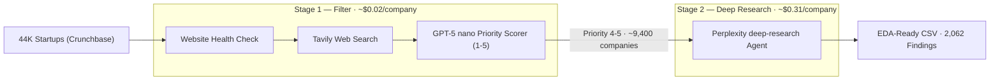

# Deep Research AI Agent

> Agentic research pipeline that processed **44,000+** startups to measure internal generative AI adoption.


**[View Production Dashboard →](presentation/production_results.html)**

Other HTML decks in `presentation/` are earlier proposal / stage-result slides kept as portfolio artifacts. The production dashboard above is the source of truth for final results.

## Research Context & The Problem

Conducted as part of my role as an AI student researcher at **UBC Sauder School of Business** under **Prof. Jan Bena**, supported by **$4K in research grants**. The research question: how is generative AI transforming the internal business processes of startups across the world?

A Perplexity deep-research call costs roughly **$1 per company**. At 44,000 startups, that's a **$44,000 bill** before writing a single line of analysis. The solution: Meticulous parameter tuning + a multi-stage agentic pipeline that uses output strength signals from Tavily API to decide where to spend the expensive compute — routing only the highest-signal companies to the deep-research agent.


## Architecture




## Engineering Highlights & Agentic Orchestration

**1. Hyperparameter Tuning**

Before the production run, the Perplexity Agent API parameters were systematically tuned using a structured async A/B test framework (`src/tests/stage_2/run_preset_test.py`). Parameters evaluated:

- `preset` — selects the underlying model and reasoning configuration (`deep-research` vs `advanced-deep-research`, each backed by a different frontier model)
- `max_steps` 
- `max_tokens` 
- `max_search_tool_calls` 


---

**2. Prompt Engineering**

Two prompt files drive the pipeline, each designed for a specific stage:

- [`prompts/stage_1_classifier.txt`](prompts/stage_1_classifier.txt) — GPT-5 nano system + user prompt. Instructs the classifier to compare Crunchbase profile against Tavily search snippets and output a `research_priority_score` (0–5). Includes few-shot examples for edge cases (generic company names, AI product companies, minimal footprint).

- [`prompts/stage_2_perplexity_prompt.txt`](prompts/stage_2_perplexity_prompt.txt) — Full deep-research agent prompt with the USE vs. SELL guardrail, source taxonomy, academic evidence standards, JSON output schema, and five few-shot examples covering positive findings, indirect evidence, and negative cases.


---

**3. Selective Model Escalation via Signal Strength**

Stage 1 uses Tavily search result quality as a proxy for a company's researchability. The GPT-5 nano classifier evaluates result count, source diversity, snippet relevance, and match confidence against the Crunchbase profile. Weak signals (generic names surfacing unrelated entities, thin snippets, dead sites) score 0–3 and stop there. High signals score 4–5 and escalate. This is the core mechanism behind the cost reduction: **spend $0.02 to decide whether to spend $0.31**.

---

**4. Academic-Grade Evidence Standards**

The Stage 2 prompt enforces strict research validity constraints baked directly into the agent's system prompt:

- **No source = no finding.** Every claim requires a citable URL.
- **No inference.** Report only what sources explicitly state.
- **Tool specificity.** "AI coding tool" is rejected; "GitHub Copilot" is required.
- **USE vs. SELL guardrail.** A company building AI products is not evidence of internal adoption — separate evidence of operational use is required.
- **Negative result documentation.** When no finding is found, the agent produces a structured `no_finding_analysis` explaining what was checked and why it didn't qualify.

---

**5. Rate Limiting & Async**

Stage 2 runs `AsyncPerplexity` with configurable concurrency (tested up to 250 workers in production), enforced by a custom `AsyncRateLimiter` (`src/common/rate_limiter.py`) that caps requests per minute to stay within API tier limits. A hard USD `--budget-cap` stops new calls when cumulative spend reaches the ceiling. Three-state Ctrl+C handling (PAUSE → RESUME or STOP) makes multi-hour runs operable without process loss.

---

**6. Structured JSON Schema for EDA-Ready Output**

Every agent response conforms to a strict JSON Schema enforced via Perplexity's `response_format` parameter. Findings land directly into a master JSONL with no post-processing — each row includes `AI_tool_used`, `business_function`, `use_case`, `evidence_description`, `source_url`, `source_type`, `cost_usd`, `input_tokens`, `output_tokens`, and `model_used`. The master CSV is regenerated after every run. No cleanup step, no manual review needed to load into Pandas.


## Tech Stack

| Layer | Tools |
|-------|-------|
| Deep research agent | Perplexity Agent API (`deep-research` preset) |
| Stage 1 classifier | OpenAI GPT-5 nano (via `httpx`) |
| Web search / signal probe | Tavily API (via `httpx`) |
| Async runtime | Python `asyncio`, `httpx`, custom `AsyncRateLimiter` |
| Schema | JSON Schema via Perplexity `response_format` |
| Data layer | Incremental JSONL, EDA-ready CSV |
| Tuning | Async A/B hyperparameter scripts under `src/tests/stage_2/` |

---

## Academic Findings Snapshot

**Findings by business function**

`Engineering 28.3%` · `Marketing 23.7%` · `Operations 23.0%` · `Customer Service` · `Sales` · `HR` · `Finance`

GenAI is not just an engineering tool. Marketing and Operations together account for nearly half of all findings.

**Evidence by source type**

`Company blogs 36.1%` · `Job postings 25.3%` · `Podcasts/video 12.9%` · `Website content 7.9%` · `Press coverage 7.6%`

[**View the full interactive dashboard →**](presentation/production_results.html)


## Notable Agent Findings

**KONAMIYA** · `Sales` · `Retell AI, OpenAI` · [Source →](https://konamiya.com/en/how-we-automated-lead-qualification-with-retell-ai-make-com-and-clickup/)

Built an end-to-end automated lead qualification pipeline using Retell AI and OpenAI — replacing manual SDR workflows with an AI-native outbound system, documented publicly on their blog.

**HealthyLongevity.clinic** · `Customer Service` · `ChatGPT` · [Source →](https://www.healthylongevityclinic.cz/blog/novy-pristup-healthylongevity-clinic-hlc-a-jak-je-to-vlastne-se-zpomalenim-starnuti)

Integrated ChatGPT into clinical systems for biomarker analysis. Evidence sourced from a Czech-language blog post — the agent found, retrieved, and correctly interpreted a foreign-language source without any additional configuration.


## Repo Structure

The Stage 2 research line is migrating off a `src/`-centric layout into
standalone architecture packages plus an eval harness. March production
outputs under `outputs/stage2/` stay readable. `src/` remains as the Stage 1
pipeline home and a temporary Stage 2 compatibility shim.

```
├── parallel_channel_search/       # PCS — 3 equal-depth channel agents (Phase 1 stub)
├── signal_gated_search/           # SGS — scouts → ranked dig (+ rescue) (Phase 1 stub)
├── unified_adaptive_search/       # UAS — single medium call (extracted from Stage 2 patterns)
├── evals/                         # Standalone harness + instance archive
│   ├── instances/                 # Categorized archive (tuning / benchmark / verification)
│   ├── runs/                      # Per-arm run bundles (gitignored)
│   └── ...                        # CLI, panel, configs, dashboard renderers
├── contracts/                     # Shared Finding + component cost ledger types
├── prompts/
│   ├── stage_1_classifier.txt
│   ├── stage_2_perplexity_prompt.txt
│   ├── shared/                    # Shared prompt blocks (growing)
│   └── <architecture>/            # Optional per-system overrides
├── src/                           # Stage 1 + legacy Stage 2 production runner (shim during migration)
│   ├── stage_1/                   # Filter pipeline (Tavily + GPT scorer)
│   ├── stage_2/                   # production_agent_runner.py (March batch path)
│   ├── tests/stage_2/             # Prior hyperparameter tuning scripts
│   ├── common/
│   └── config.py
├── credentials/                   # *.txt.template tracked; real keys gitignored
├── crunchbase_data/               # Input CSV + Stage 2 P4–P5 JSONL
├── outputs/                       # gitignored — Stage 1/2 pipeline artifacts
│   ├── stage1/
│   └── stage2/                    # March master JSONL/CSV (keep readable)
└── presentation/
    └── production_results.html    # March production dashboard
```

### Eval CLI (architecture playground)

Architecture keys (kebab-case): `parallel-channel-search`, `signal-gated-search`,
`unified-adaptive-search` (aliases: `pcs`, `sgs`, `uas`).

```bash
# Estimate spend before a paid run (no API calls)
python -m evals cost-preview unified-adaptive-search

# Archive an instance (stubs until tuning/benchmark/verification dashboards land)
python -m evals run-tuning uas --stage screen
python -m evals run-benchmarks uas
python -m evals run-verification

# Open the categorized landing index under evals/instances/
python -m evals open-dashboard
```

Eval artifacts stay under `evals/` so the harness is standalone. Tuning Stage A
screen is next; benchmark bake-off and Stage 3 verification remain stubs.

